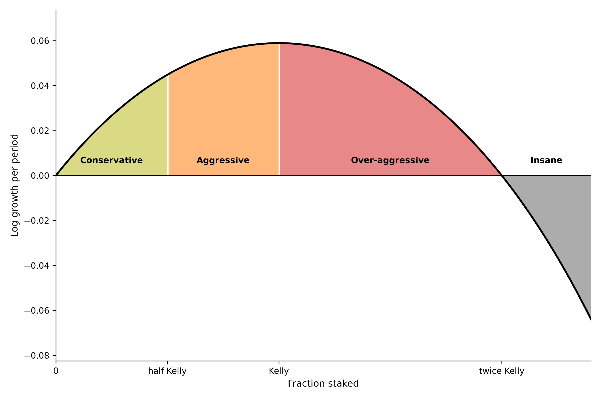
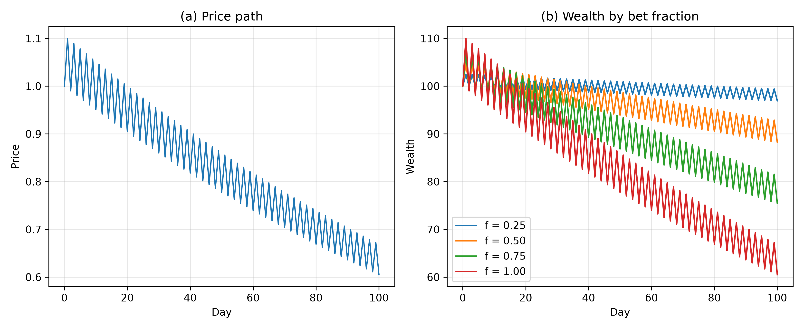
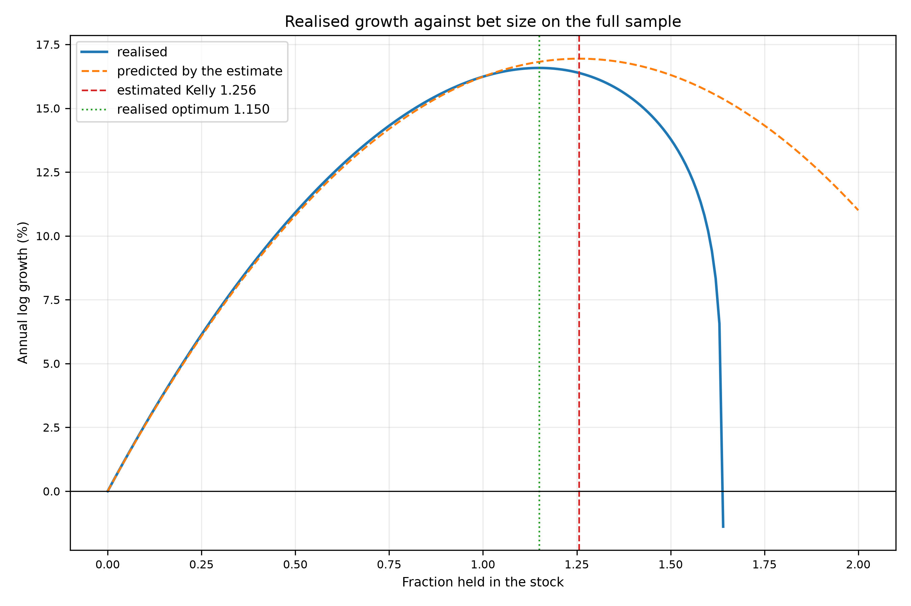
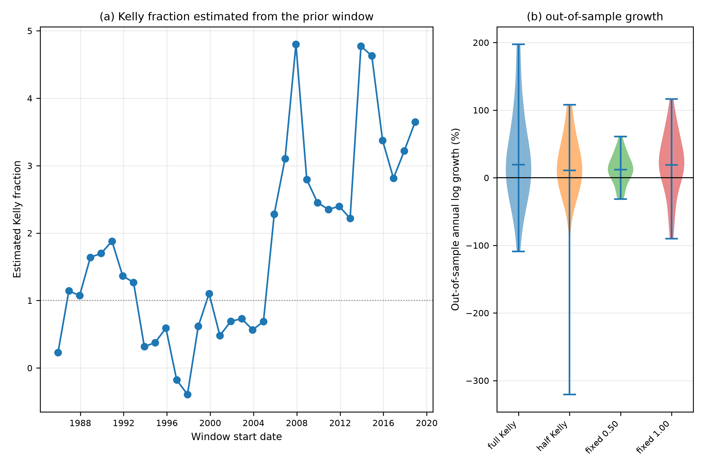

# Kelly Criterion

Rev. 10 | Created: 2026-08-30 | Updated: 2026-08-30 16:13 UTC

> **Goal** — 베팅 비중 하나가 장기 성장률을 얼마나 좌우하는지 수치로 확정한다. "적당히 걸어라" 가 아니라 "최적 비중이 얼마이고, 거기서 벗어나면 성장률과 손실 확률이 각각 얼마나 나빠지는가" 를 판단 기준으로 쓸 수 있게 한다.
>
> **Non-Goals** — 승률과 배당률의 추정은 다루지 않는다. 이 문서는 그 값들이 정확히 주어졌다고 보고 비중만 푼다. 자산 2개 이상의 동시 배분, 세금과 거래비용도 범위 밖이다.
>
> **Background** — 유리한 베팅을 찾는 것과 얼마를 걸지 정하는 것은 다른 문제이다. 기대값이 양수인 베팅도 크게 걸면 장기 성장률이 0 이나 음수가 된다. John Kelly 는 1956년에 이 문제를 기대 log 자산의 최대화로 정식화했다 \[[1](#ref-1)\].

## 1. The sizing problem

한 번의 베팅에서 기대 수익이 양수라는 사실은 얼마를 걸어야 하는지를 알려주지 않는다. 같은 베팅을 반복할 때 자산은 더해지는 것이 아니라 곱해지기 때문이다.

곱셈으로 자라는 자산에서는 산술평균이 길잡이가 되지 못한다. 한 기간에 2배가 되고 다음 기간에 반토막이 나면 산술평균 수익률은 +25% 이지만 자산은 제자리이다. 실제로 남는 것은 기하평균이고, 기하평균은 비중에 대해 단조롭지 않다. 적게 걸면 성장이 느리고, 많이 걸면 변동성이 성장을 깎아먹는다. 그 사이 어딘가에 최대점이 있다.

Kelly criterion 은 그 최대점을 기대 log 자산의 최대화 문제로 정식화해 닫힌 형태로 푼다.

## 2. Formulation

### 2.1 The bet

한 기간에 결과가 둘뿐인 베팅을 둔다. 자산의 비중 $f$ 를 위험 자산에 걸고 나머지 $1-f$ 는 현금으로 둔다. 위험 자산은 확률 $p$ 로 $u$ 배, 확률 $1-p$ 로 $d$ 배가 되고 현금은 $c$ 배가 된다.

한 기간이 지난 뒤 자산의 배수는 두 값 중 하나이다.

$$W_{\text{up}} = f u + (1-f) c, \qquad W_{\text{down}} = f d + (1-f) c$$

베팅이 성립하려면 $d \lt c \lt u$ 여야 한다. 현금이 두 결과의 바깥에 있으면 한쪽이 다른 쪽을 지배해 고를 것이 없어진다.

### 2.2 Log growth as the objective

$n$ 기간 뒤의 자산은 각 기간 배수의 곱이다. 곱의 log 는 합이므로, log 를 취하면 문제가 덧셈으로 바뀐다. 큰 수의 법칙이 덧셈에 적용되므로 장기 성장률은 기대 log 배수로 수렴한다.

$$g(f) = p \ln W_{\text{up}} + (1-p) \ln W_{\text{down}}$$

$g$ 를 최대화하는 것과 장기 자산을 최대화하는 것이 같은 문제가 되는 이유가 여기에 있다. 기대 자산이 아니라 기대 log 자산을 최대화한다는 점이 핵심이다. 기대 자산은 극히 드문 경로 하나에 끌려가므로 흔한 결과를 대표하지 못한다.

### 2.3 Closed-form optimum

$A = u - c$, $B = d - c$ 로 두면 $g'(f) = 0$ 이 일차식이 되어 해가 하나로 떨어진다.

$$f^{\ast} = -\frac{c \left(p A + (1-p) B\right)}{A B}$$

분자의 $p A + (1-p) B$ 는 현금 대비 초과 수익의 기댓값이고 분모의 $A B$ 는 음수이다. 따라서 기대 초과 수익이 양수일 때만 $f^{\ast}$ 가 양수가 된다. 유리하지 않은 베팅에는 걸지 않는다는 상식이 식에서 그대로 나온다.

### 2.4 Ruin fraction

$f$ 를 무한정 키울 수 없다. 하락이 한 번 나왔을 때 자산이 0 이하가 되는 비중이 존재하기 때문이다.

$$f_{\text{ruin}} = \frac{c}{c - d}$$

$f \ge f_{\text{ruin}}$ 이면 $W_{\text{down}} \le 0$ 이 되어 log 가 정의되지 않는다. 이 값은 최적 비중과 무관하게 정의역의 상한이며, 뒤의 모든 수치는 이 상한 안에서만 의미가 있다.

## 3. Shape of the growth curve

이 장의 수치는 $u = 2$, $d = 0.5$, $c = 1$, $p = 0.5$ 인 베팅에서 얻었다. 이 값에서 위험 자산 단독의 기하평균은 $\sqrt{u d} = 1$ 이므로 자산 자체의 장기 성장률은 0 이고, 성장은 오직 비중 선택에서 나온다. 계산 방법과 재현 절차는 [Appendix C](#appendix-c-the-kellypy-script) 에 있다.

### 3.1 Growth by fraction

이 베팅의 최적 비중은 0.500000 이고 그 지점의 기대 log 성장률은 +0.058892, 기간당 수익률로는 +6.0660% 이다. 파산 비중은 2.0 이므로 최적 비중은 그 4분의 1 지점에 있다.

Table 1. Growth rate and simulated outcome by fraction
| Fraction | Analytic log growth | Return per period | Share of maximum | Simulated median | 5th percentile | 95th percentile | Loss probability |
|---|---|---|---|---|---|---|---|
| 0.100 | +0.022008 | +2.2252% | 0.3737 | +0.022008 | +0.0103 | +0.0337 | 0.00085 |
| 0.250 | +0.044806 | +4.5825% | 0.7608 | +0.044806 | +0.0163 | +0.0733 | 0.00665 |
| 0.375 | +0.055407 | +5.6971% | 0.9408 | — | — | — | — |
| 0.500 | +0.058892 | +6.0660% | 1.0000 | +0.058892 | +0.0034 | +0.1143 | 0.04320 |
| 0.625 | +0.055407 | +5.6971% | 0.9408 | — | — | — | — |
| 0.750 | +0.044806 | +4.5825% | 0.7608 | +0.044806 | -0.0376 | +0.1272 | 0.18680 |
| 1.000 | +0.000000 | +0.0000% | 0.0000 | +0.000000 | -0.1109 | +0.1109 | 0.45305 |

0.375 와 0.625 는 해석해만 계산했고 시뮬레이션 대상이 아니므로 뒤 네 열을 `—` 로 둔다.

이 표의 수치는 서로 독립인 세 방법으로 확인했다.

- Closed form — 2.3 절의 식에 값을 넣어 얻은 $f^{\ast} = 0.500000$.
- Numeric search — 같은 성장 함수를 수치 최적화로 최대화해 얻은 $f^{\ast} = 0.500000$. 닫힌 해와의 차이는 3.33e-16 이다.
- Monte Carlo — 게임을 실제로 반복해 얻은 기간당 성장률 표본. 그 중앙값이 해석해와 소수점 여섯 자리까지 일치한다.

세 번째가 가장 중요하다. 기대 log 성장률은 정의상 log 자산의 기댓값이지 흔한 결과가 아닌데, 중앙값과 일치한다는 것은 2.2 절의 해석이 맞다는 뜻이다. 기간이 길어질수록 log 자산이 정규분포에 가까워져 평균과 중앙값이 같아지기 때문이며, 4.3 절이 지적한 대로 기간이 짧으면 이 일치는 깨진다.


Fig 1. Expected log growth against bet size, with the simulated medians overlaid

### 3.2 Flatness near the optimum

곡선은 최대점 부근에서 평평하다. 비중을 0.375 나 0.625 로 잡아도 성장률은 최대값의 0.9408 배이다. 비중을 25% 잘못 잡고도 성장의 6% 만 잃는다는 뜻이다.

승률과 배당률을 정확히 아는 상황은 실제로 없으므로 이 평평함이 Kelly criterion 을 쓸 수 있게 만든다. 최적점을 정확히 맞히지 못해도 근처면 충분하다.

가장자리는 반대로 가파르다. 비중 1.000 에서 성장률은 정확히 0 이 된다. 기대값이 양수인 베팅에 전 재산을 걸면 장기적으로 제자리라는 뜻이며, 그 지점은 파산 비중의 절반에 불과하다.

### 3.3 Symmetric growth, asymmetric risk

곡선은 $f^{\ast}$ 를 축으로 대칭이다. 0.250 과 0.750 의 성장률이 +0.044806 로 같고, 0.375 와 0.625 도 +0.055407 로 같다.

이 대칭이 오해를 부른다. 성장률만 보면 최적점에서 같은 거리만큼의 underbetting 과 overbetting 이 동등해 보이지만, 손실 확률은 0.250 에서 0.00665, 0.750 에서 0.18680 으로 28배 차이가 난다.

두 방향이 바꾸는 것이 다르기 때문이다. underbetting 은 분포 전체를 좁히고, overbetting 은 분포를 넓힌 채로 중앙값만 끌어내린다. 성장률이라는 한 숫자는 이 차이를 담지 못한다.


Fig 2. Simulated growth distribution by bet size

비중이 커질수록 분포의 폭이 넓어진다. 5th percentile 과 95th percentile 의 간격은 0.100 에서 0.0235, 0.500 에서 0.1109, 1.000 에서 0.2218 이다. 5th percentile 의 부호는 0.500 까지 양수이고 0.750 부터 음수이다.

## 4. Practical use

### 4.1 Four zones of bet size

실전에서 필요한 것은 최적 비중의 값 하나가 아니라, 자기 비중이 어느 구간에 있는지이다. 2.3 절의 식이 주는 $f^{\ast}$ 를 기준으로 삼으면 비중 축은 네 구간으로 나뉜다.

$$f^{\ast} = -\frac{c \left(p A + (1-p) B\right)}{A B}, \qquad A = u - c, \qquad B = d - c$$

이 게임의 값 $u = 2$, $d = 0.5$, $c = 1$, $p = 0.5$ 를 넣으면 $f^{\ast} = 0.500$ 이다.


Fig 3. Growth curve split into four zones at half, one and two times the optimum

- $f^{\ast}$ 아래 절반 — 성장률을 일부 포기하는 대신 분포가 좁아지는 구간.
- $f^{\ast}$ 의 절반과 $f^{\ast}$ 사이 — 성장률이 최대에 가까우면서 아직 최적점을 넘지 않은 구간.
- $f^{\ast}$ 와 $2 f^{\ast}$ 사이 — 성장률이 떨어지는데 변동성은 계속 커지는 구간. 더 걸어서 잃는다.
- $2 f^{\ast}$ 위 — 성장률이 음수인 구간. 이길 확률이 있는 베팅으로 장기적으로 확실히 잃는다.

Fig 3 에 세 경계를 점으로 찍고 값을 함께 적었다. half Kelly 는 f = 0.250 에서 g = +0.0448, Kelly 는 f = 0.500 에서 g = +0.0589, twice Kelly 는 f = 1.000 에서 g = +0.0000 이다.

이 중 twice Kelly 가 실질적인 상한이다. $f^{\ast}$ 는 성장률이 꺾이기 시작하는 지점일 뿐이어서 조금 넘겨도 성장률은 여전히 양수이지만, $2 f^{\ast}$ 를 넘는 순간 부호가 바뀌어 이길 확률이 있는 베팅으로 장기적으로 확실히 잃는다. 이 게임에서 $2 f^{\ast}$ 는 정확히 1.000 이므로 전 재산을 거는 것이 곧 그 경계이며, Table 1 의 비중 1.000 행이 +0.000000 인 것이 같은 값이다.

half Kelly 는 반대쪽 끝을 보여준다. 성장률이 +0.0448 로 최대값 +0.0589 의 0.7608 배이므로, 비중을 절반으로 줄여도 성장의 4분의 1 미만을 내놓는다.

Fig 3 의 점선 두 개가 그 대가를 y 축에서 직접 읽게 해 준다. 두 점선의 높이는 half Kelly 에서 Kelly 로 옮길 때 성장률이 얼마나 오르는지를 나타내며, 두 성장률의 차이는 log 의 비로 정리된다.

$$\Delta g = g(f^{\ast}) - g\!\left(\frac{f^{\ast}}{2}\right) = p \ln \frac{f^{\ast} u + (1 - f^{\ast}) c}{\frac{f^{\ast}}{2} u + \left(1 - \frac{f^{\ast}}{2}\right) c} + (1-p) \ln \frac{f^{\ast} d + (1 - f^{\ast}) c}{\frac{f^{\ast}}{2} d + \left(1 - \frac{f^{\ast}}{2}\right) c}$$

이 게임의 값을 넣으면 이기는 쪽의 배수는 1.2500 에서 1.5000 으로, 지는 쪽의 배수는 0.8750 에서 0.7500 으로 간다.

$$\Delta g = 0.5 \ln \frac{1.5000}{1.2500} + 0.5 \ln \frac{0.7500}{0.8750} = 0.5 \times 0.182322 + 0.5 \times (-0.154151) = 0.014085$$

두 항의 부호가 반대인 것이 이 식의 요점이다. 비중을 올리면 이기는 쪽 배수는 커지지만 지는 쪽 배수는 작아지고, 남는 것은 두 효과의 차이뿐이다. 그래서 비중을 두 배로 올려도 성장률은 +0.0448 에서 +0.0589 로 0.014085 만 오른다.

곡선이 최적점 근처에서 이차식에 가깝다는 성질을 쓰면 어림값이 나온다. 정확히 이차라면 $g(f^{\ast}/2) = \frac{3}{4} g(f^{\ast})$ 이므로 $\Delta g = g(f^{\ast}) / 4 = 0.014723$ 이다. 실제 비는 0.760824 로 3/4 보다 조금 크고, 어림값은 실제 0.014085 를 4.5264% 넘게 잡는다.

경계가 $f^{\ast}$ 와 $2 f^{\ast}$ 에 오는 것은 이 게임의 우연이 아니다. $g$ 는 $f=0$ 에서 0 이고 위로 볼록하므로, 최대점의 두 배에서 다시 0 을 지난다. 어떤 베팅이든 같은 구조를 갖는다.

### 4.2 Half Kelly

추정에 자신이 없을 때 최적 비중의 절반만 거는 half Kelly 관행 \[[2](#ref-2)\] 이 널리 쓰인다. 3.3 절의 비대칭이 그 근거이다.

이 베팅에서 0.250 은 성장률을 최대값의 0.7608 배로 줄이는 대가로 손실 확률을 0.04320 에서 0.00665 로 낮춘다. 성장의 24% 를 내주고 손실 확률을 6.5분의 1 로 만드는 교환이다. 추정 오차가 최적 비중을 과대평가하는 쪽으로 작용한다는 점까지 고려하면, 이 교환은 대부분의 상황에서 유리하다.

### 4.3 Conditions that break the result

- 결과가 둘뿐인 베팅. 실제 자산의 수익률은 연속 분포이며, 그 경우 최적 비중은 다른 형태를 갖는다.
- $p$, $u$, $d$ 가 정확히 알려졌다는 가정. 실제로는 추정값이며, 오차는 최적 비중을 과대평가하는 쪽으로 작용한다.
- 자산 하나와 현금. 여러 자산을 동시에 굴릴 때는 자산 간 correlation 이 들어와 비중이 벡터가 된다.
- 기간당 결과가 독립이라는 가정. 추세나 평균회귀가 있으면 이 해는 최적이 아니다.
- 짧은 기간. 2.2 절의 수렴은 기간이 길 때 성립하며, 기간이 짧으면 기대 log 성장률과 실제 경로의 중앙값이 어긋난다.

## References

<a id="ref-1"></a>
[1] Kelly, J. L. Jr. "A New Interpretation of Information Rate." Bell System Technical Journal 35, no. 4 (1956): 917–926. DOI 10.1002/j.1538-7305.1956.tb03809.x

<a id="ref-2"></a>
[2] Thorp, E. O. "The Kelly Criterion in Blackjack, Sports Betting, and the Stock Market." In Handbook of Asset and Liability Management, Volume 1, 385–428. North-Holland, 2006. DOI 10.1016/S1872-0978(06)01009-X

---

## Appendix A. Terminology

- **closed form** — 반복 계산 없이 식 하나로 값을 주는 해.
- **full Kelly** — 추정한 최적 비중을 그대로 거는 것.
- **half Kelly** — 최적 비중의 절반만 거는 관행.
- **Kelly criterion** — 기대 log 자산을 최대화하는 베팅 비중을 구하는 규칙.
- **log growth** — 자산 배수의 자연로그. 복리로 더해지므로 장기 성장률의 단위가 된다.
- **max drawdown** — 직전 최고점 대비 자산이 가장 크게 줄어든 폭.
- **Monte Carlo** — 난수로 경로를 여러 번 생성해 분포를 추정하는 방법.
- **overbetting** — 최적 비중보다 크게 거는 것.
- **ruin fraction** — 한 번의 하락으로 자산이 0 이하가 되는 최소 비중.
- **underbetting** — 최적 비중보다 작게 거는 것.

## Appendix B. A path with no edge

본문의 게임은 배수가 2배와 반토막이라 값이 크다. 이 부록은 훨씬 얌전한 가격 경로 하나를 끝까지 따라가, 우위가 없을 때 비중이 무엇을 하는지 보인다. 주가는 1 에서 출발해 홀수 날 10% 오르고 짝수 날 10% 내리며, 이를 100일 반복한다. 투자금은 100 이고, 매일 자산의 고정 비율 $f$ 를 그 주식에 두고 나머지는 현금으로 둔다. 현금 배수는 본문과 같이 $c = 1$ 이다.


Fig 4. Price path and the wealth it produces at four bet fractions

Table 2. Wealth after 100 days by bet fraction, starting from 100
| Bet fraction | Two-day multiplier | Final wealth | Total return |
|---|---|---|---|
| 0.25 | 0.999375 | 96.9224 | -3.0776% |
| 0.50 | 0.997500 | 88.2359 | -11.7641% |
| 0.75 | 0.994375 | 75.4241 | -24.5760% |
| 1.00 | 0.990000 | 60.5006 | -39.4994% |

네 비중 모두 손실이며, 비중이 클수록 손실이 크다. 이틀이 한 주기이므로 100일은 주기 50회이고, 한 주기의 배수는 다음과 같다.

$$(1 + 0.10 f)(1 - 0.10 f) = 1 - 0.01 f^2$$

$f$ 가 어떤 양수여도 이 값은 1 보다 작고, $f$ 가 커질수록 작아진다. 100일 뒤 자산은 곧 다음 값이다.

$$W_{100} = 100 \left(1 - 0.01 f^2\right)^{50}$$

$f = 1.00$ 을 넣으면 $100 \times 0.99^{50} = 60.5006$ 으로 Table 2 의 마지막 행과 같다.

Bet fraction 1.00 은 투자금 전액을 그 주식에 두는 것을 뜻한다. 현금 몫이 0 이 되므로 자산 경로는 주가 경로에 100 을 곱한 것과 같다. Fig 4 의 (a) 가 100일 뒤 0.605006 에서 끝나는 것과 (b) 의 $f = 1.00$ 선이 60.5006 에서 끝나는 것이 같은 수이다. 다만 이 부록에서 1.00 이 비중의 상한은 아니다. 하루 최대 손실이 10% 이므로 2.4 절의 파산 비중은 $1 / 0.10 = 10$ 이고, 그 아래라면 빌린 돈을 더해 1.00 을 넘길 수 있다. 그럴수록 손실만 커진다.

이 경로에 우위가 없기 때문이다. 상승과 하락이 같은 확률로 오는 베팅으로 보면 $u = 1.10$, $d = 0.90$, $c = 1$, $p = 0.5$ 이므로 2.3 절의 식에서 분자의 $p A + (1-p) B$ 가 $0.5 \times 0.10 + 0.5 \times (-0.10) = 0$ 이 되어 $f^{\ast} = 0$ 이다. 최적 비중이 0 이라는 것은 걸지 말라는 뜻이며, 0 보다 큰 모든 비중이 overbetting 이다. Table 2 는 그 대가를 비중별로 적은 것이다.

산술평균과 기하평균의 차이로 읽어도 같다. 하루 수익률의 산술평균은 $f = 1.00$ 에서 $(+10\% - 10\%) / 2 = 0$ 이지만 기하평균은 $\sqrt{1.10 \times 0.90} = 0.994987$ 로 1 보다 작다. 이 격차가 변동성이 성장률에서 빼앗아 가는 몫이며, 비중을 $f$ 로 줄이면 변동폭이 $f$ 배가 되므로 그 몫은 $f^2$ 배로 줄어든다. Table 2 의 두 번째 열이 $f^2$ 에 비례해 1 에서 멀어지는 것이 그 관계이다.

#### Reproduction

`alternating.py` 는 이 문서 옆의 `src` folder 에 있으며 다른 script 를 import 하지 않는다. Option 없이 실행하면 script 이름과 version 을 출력한다. `-h` 로 전체 목록을, `-v` 로 version 을 본다. `--output-folder` 는 필수이며 그 아래 `alternating` folder 가 만들어진다. 아래 명령은 이 문서가 있는 folder 를 기준으로 하며, `wealth_paths.csv`, `summary.csv`, `wealth_paths.png` 를 남긴다.

```bash
python3 src/alternating.py --output-folder Kelly_Criterion_fig
```

Table 3. CLI options of `alternating.py`
| Option | Type | Default | Required | Description |
|---|---|---|---|---|
| `--output-folder` | path | — | yes | 산출물 root |
| `--up-rate` | float | 0.10 | no | 상승일의 수익률 |
| `--down-rate` | float | 0.10 | no | 하락일의 손실률 |
| `--n-days` | int | 100 | no | 경로의 길이 |
| `--initial-price` | float | 1.0 | no | 0일의 주가 |
| `--initial-wealth` | float | 100.0 | no | 0일의 자산 |
| `--fractions` | float list | 0.25 0.50 0.75 1.00 | no | 자산 경로를 그릴 비중 |

파산 비중 이상의 `--fractions` 는 에러로 막는다. 그 비중에서는 하락일 하루가 자산을 0 이하로 만들어 이후의 경로가 뜻을 잃기 때문이다.

## Appendix C. The `kelly.py` script

본문의 모든 수치는 `kelly.py` 한 번의 실행에서 나왔다. 이 부록은 그 실행을 재현하는 방법과 실행 방법을 담는다.

#### Parameters

Table 4. Bet and simulation parameters of the run cited in this document
| Parameter | Value | Meaning |
|---|---|---|
| `--up-factor` | 2.0 | 상승 시 위험 자산 배수 |
| `--down-factor` | 0.5 | 하락 시 위험 자산 배수 |
| `--cash-factor` | 1.0 | 현금 배수 |
| `--up-prob` | 0.5 | 상승 확률 |
| `--max-fraction` | 1.0 | 성장 곡선 격자의 최대 비중 |
| `--grid-points` | 401 | 격자점 수 |
| `--sim-fractions` | 0.10 0.25 0.50 0.75 1.00 | Monte Carlo 대상 비중 |
| `--n-periods` | 100 | 경로당 기간 수 |
| `--n-paths` | 20,000 | 비중당 경로 수 |
| `--seed` | 20260829 | 난수 seed |

외부 자료를 읽지 않으며 난수는 seed 가 고정된 generator 에서 나온다. 같은 seed 와 같은 option 이면 결과가 재현된다.

#### Output files

산출물은 이 문서 옆의 `Kelly_Criterion_fig` folder 에 둔다.

```text
Kelly_Criterion_fig/
├── growth_curve.csv
├── simulated_log_growth.csv
├── growth_curve.png
├── growth_violin.png
└── growth_zones.png
```

- `growth_curve.csv` — 1 file, shape (401 × 3). 1 row = 1 fraction on the grid.
- `simulated_log_growth.csv` — 1 file, shape (100,000 × 3). 1 row = 1 path × 1 fraction.
- `growth_curve.png` — 1 file.
- `growth_violin.png`, `growth_zones.png` — 2 files.

Table 1 의 해석해 열은 `growth_curve.csv` 에서, 시뮬레이션 열은 `simulated_log_growth.csv` 에서 계산했다. 분포를 그리는 figure 는 요약값이 아니라 표본을 저장하므로, 본문의 백분위수는 figure 에서 읽은 값이 아니라 표본에서 계산한 값이다.

#### Safeguards

- 닫힌 해와 수치 해의 차이가 허용치를 넘으면 실행을 중단한다. 성장 함수를 잘못 적었거나 최적화 구간을 잘못 잡았을 때 결과가 조용히 틀린 채로 남는 것을 막는다.
- `--max-fraction` 이 2.4 절의 파산 비중에 닿으면 에러를 낸다. 정의역 밖을 조용히 잘라내면 사용자는 자기가 지정한 구간이 그대로 쓰인 줄 알게 된다.
- $d \lt c \lt u$ 를 어기는 입력은 생성 시점에 에러로 막는다.

#### Command line

Option 없이 실행하면 script 이름과 version 을 출력한다. `-h` 로 전체 목록을, `-v` 로 version 을 본다. `--output-folder` 는 필수이다. `kelly.py` 는 다른 script 를 import 하지 않으며 이 문서 옆의 `src` folder 에 있다. 아래 명령은 이 문서가 있는 folder 를 기준으로 한다.

```bash
python3 src/kelly.py --output-folder .
python3 src/kelly.py --output-folder . --up-prob 0.55 --sim-fractions 0.1 0.2 0.3
```

`--output-folder` 로 준 folder 아래 `kelly` folder 가 만들어지므로, 본문이 인용하는 `Kelly_Criterion_fig` 로 쓰려면 그 folder 이름을 바꾼다.

Table 5. CLI options of `kelly.py`
| Option | Type | Default | Required | Description |
|---|---|---|---|---|
| `--output-folder` | path | — | yes | 산출물 root |
| `--up-factor` | float | 2.0 | no | 상승 시 위험 자산 배수 |
| `--down-factor` | float | 0.5 | no | 하락 시 위험 자산 배수 |
| `--cash-factor` | float | 1.0 | no | 현금 배수 |
| `--up-prob` | float | 0.5 | no | 상승 확률 |
| `--max-fraction` | float | 1.0 | no | 성장 곡선 격자의 최대 비중 |
| `--grid-points` | int | 401 | no | 격자점 수 |
| `--sim-fractions` | float list | 0.10 0.25 0.50 0.75 1.00 | no | Monte Carlo 대상 비중 |
| `--n-periods` | int | 100 | no | 경로당 기간 수 |
| `--n-paths` | int | 20000 | no | 비중당 경로 수 |
| `--chunk-size` | int | 4000 | no | 한 번에 계산할 경로 수 |
| `--seed` | int | 20260829 | no | 난수 seed |

## Appendix D. Backtest on real prices

본문의 수치는 승률과 배당률을 정확히 아는 베팅에서 나왔다. 4.3 절은 그 가정이 깨지면 무슨 일이 생기는지를 목록으로만 적었다. 이 부록은 그 중 두 가지를 실제 시세로 확인한다. 최적 비중이 실제로 성장률을 최대화하는지, 그리고 과거 자료로 추정한 비중을 앞으로 적용했을 때도 통하는지이다.

Table 6. Price data and backtest settings
| Item | Value |
|---|---|
| Source | Kaggle, Stock Market Dataset ( jacksoncrow/stock-market-dataset ) |
| Origin | Yahoo Finance, snapshot dated 2020-04-02 |
| Ticker | AAPL, `Adj Close` |
| Period | 1980-12-12 to 2020-04-01, 9,909 rows |
| Cash return | 0% |
| Rebalancing | every 21 trading days |
| Estimation window | 5 years |
| Application window | 1 year, non-overlapping |

위험 자산 하나와 현금이라는 본문의 구조를 그대로 쓴다. 연속 근사에서 최적 비중은 $(\mu - r) / \sigma^2$ 이고, $\mu$ 는 log 수익률의 평균에 분산의 절반을 더해 얻은 산술 drift 이다.

#### The formula in sample

전체 표본의 추정치는 drift +26.9716%, volatility 46.3352% 이고, 여기서 나오는 최적 비중은 1.2563 이다. 실제로 성장률이 가장 높았던 비중은 1.1500 이다. 두 값의 차이는 0.11 이며, 추정 비중에서 실제로 얻은 성장률은 16.3673% 로 실제 최적점의 16.5795% 보다 0.2122 %p 낮다.

Table 7. Realised against predicted annual log growth in %, full sample
| Fraction | Realised | Predicted | Gap |
|---|---|---|---|
| 0.25 | +6.1321 | +6.0720 | +0.0602 |
| 0.50 | +10.9142 | +10.8021 | +0.1121 |
| 0.75 | +14.3169 | +14.1904 | +0.1265 |
| 1.00 | +16.2368 | +16.2368 | +0.0000 |
| 1.15 | +16.5795 | +16.8206 | -0.2410 |
| 1.26 | +16.3673 | +16.9417 | -0.5743 |
| 1.40 | +15.3482 | +16.7201 | -1.3718 |
| 1.60 | +10.1875 | +15.6736 | -5.4860 |
| 1.65 | ruined | +15.2777 | — |


Fig 5. Realised growth against bet size, with the curve the full-sample estimate predicts

식은 최적점 아래에서 잘 맞는다. 비중 1.00 까지 실제와 예측의 차이는 0.13 %p 를 넘지 않는다. 최적점 위에서는 빠르게 벌어져 1.40 에서 1.37 %p, 1.60 에서 5.49 %p 이며, 1.65 에서는 포트폴리오가 완전히 사라지는데 식은 여전히 +15.2777% 를 예측한다.

이 비대칭의 원인은 lognormal 가정이다. 실제 수익률의 왼쪽 꼬리가 정규분포보다 두꺼워서, 비중을 키울수록 식이 담지 못하는 손실이 커진다. 3.3 절이 시뮬레이션에서 보인 비대칭이 실제 자료에서는 더 심하게 나타난다. 성장률 곡선이 대칭이 아니라 한쪽에서 절벽을 만든다.

이 표본에서 격자의 201개 비중 중 36개가 파산했고 그 최저값은 1.6500 이다. AAPL 이 2000-09-25 부터 21거래일 동안 60.96% 하락했기 때문이며, 그 구간을 넘기지 못하는 비중은 모두 여기에 속한다. 2.4 절의 파산 비중이 실제 자료에서는 이 형태로 나타난다.

또한 실제 최적점에서 겪는 최대 낙폭은 -87.10% 이다. 비중 0.50 에서는 -48.13% 이다. 성장률만 최대화하면 자산의 8할 이상이 사라지는 구간을 지나야 한다.

#### Out of sample

앞의 수치는 전체 기간을 다 본 뒤에 계산한 것이라 실제로 쓸 수 없는 값이다. 여기서는 각 구간마다 직전 5년만 보고 비중을 정한 뒤 그 다음 1년에 적용했다. 추정은 적용 구간을 보지 않는다.

Table 8. Out-of-sample annual log growth in % over 34 windows, 1985-12-10 to 2019-12-05
| Policy | Median | 25th percentile | 75th percentile | Worst | Best | Win rate | Median max drawdown |
|---|---|---|---|---|---|---|---|
| full Kelly | +19.4625 | -17.0711 | +61.2995 | -108.8403 | +197.3414 | 0.6765 | -24.1385 |
| half Kelly | +10.7814 | -4.1096 | +32.7826 | -320.4731 | +107.9659 | 0.7059 | -12.5031 |
| fixed 0.50 | +12.0332 | +0.8005 | +24.2183 | -31.3947 | +61.0758 | 0.7647 | -9.4107 |
| fixed 1.00 | +18.8846 | -0.4611 | +44.9537 | -90.2913 | +116.5211 | 0.7353 | -18.6601 |


Fig 6. Estimated Kelly fraction by window and the distribution of out-of-sample growth

추정된 최적 비중은 구간에 따라 -0.3923 에서 4.7991 까지 흔들렸고 중앙값은 1.5018 이다. 34개 구간 중 16개에서 추정값이 파산 비중 1.6500 을 넘었고, 2개 구간에서는 음수가 되어 공매도를 지시했다. 2007-12-03 에 시작하는 구간에서는 추정값 4.7991 이 실제로 적용되어 포트폴리오가 사라졌다.

Table 8 의 중앙값만 보면 full Kelly 가 +19.4625% 로 가장 높다. 그러나 사분위 구간이 -17.0711 에서 +61.2995 로 가장 넓고, 최악 구간은 -108.8403% 이며, 낙폭 중앙값도 -24.1385% 로 가장 크다. 고정 0.50 은 중앙값이 +12.0332% 로 낮지만 사분위 구간의 아래쪽이 양수이고 낙폭이 -9.4107% 에 그친다.

half Kelly 가 고정 0.50 보다 나쁜 것은 처음 보면 이상하다. 원인은 half Kelly 가 추정값의 절반이라는 데 있다. 추정이 음수인 두 구간에서 half Kelly 는 공매도를 하고, 그 구간에 주가가 오르면서 최악값 -320.4731% 를 만들었다. 추정값을 반으로 줄이는 것은 추정의 크기 오차만 줄일 뿐 부호 오차는 줄이지 못한다.

#### What it shows

4.2 절은 half Kelly 를 추정 오차에 대한 대비로 제시했다. 이 표본에서 그 대비는 충분하지 않다. 34개 구간 중 16개에서 추정값 자체가 이미 파산 비중을 넘었으므로, 그 절반도 여전히 위험한 크기이다.

세 가지가 남는다. 첫째, 최적 비중 공식은 값을 아는 상황에서는 실제로 맞는다. 둘째, 그 공식이 안전한 범위는 최적점 아래뿐이며 위쪽은 lognormal 가정이 감당하지 못한다. 셋째, 5년 자료로 추정한 비중은 이 한 종목에서조차 쓸 수 있는 물건이 아니었다. 본문의 결론은 그대로 유효하지만, 그것은 $p$, $u$, $d$ 를 아는 문제에 대한 결론이다.

이 표본은 종목 하나이며 사후에 크게 오른 종목이다. 위의 어떤 수치도 다른 자산으로 일반화되지 않는다.

#### Reproduction

산출물은 `Kelly_Criterion_fig/kelly_backtest` 에 있다.

- `data_provenance.json` — 1 file. 시세 자료의 출처와 읽은 기간.
- `growth_by_fraction.csv` — 1 file, shape (201 × 6). 1 row = 1 fraction on the grid.
- `walk_forward.csv` — 1 file, shape (136 × 9). 1 row = 1 window × 1 policy.
- `growth_by_fraction.png`, `walk_forward.png` — 2 files.

파산은 에러가 아니라 결과로 기록된다. `ruined` 열이 참인 행은 성장률이 정의되지 않아 비어 있으며, 표에서 제외되지 않고 개수가 보고된다. 파산을 조용히 걸러내면 가장 중요한 결과가 사라지기 때문이다.

Table 9. CLI options of `kelly_backtest.py`
| Option | Type | Default | Required | Description |
|---|---|---|---|---|
| `--output-folder` | path | — | yes | 산출물 root |
| `--price-file` | path | — | yes | 한 종목의 가격 csv |
| `--ticker` | str | — | yes | 종목 이름, 표기와 provenance 에 쓰임 |
| `--date-column` | str | Date | no | 날짜 열 이름 |
| `--price-column` | str | Adj Close | no | 가격 열 이름, 조정 종가 권장 |
| `--date-format` | str | inferred | no | 날짜 형식, 모호하면 지정 |
| `--source-name` | str | — | yes | 자료 dataset 이름 |
| `--source-url` | str | — | yes | 자료 dataset 주소 |
| `--source-origin` | str | — | yes | 그 dataset 의 원 출처 |
| `--annual-risk-free` | float | 0.0 | no | 현금 sleeve 의 연 수익률 |
| `--max-fraction` | float | 2.0 | no | 성장 곡선 격자의 최대 비중 |
| `--grid-points` | int | 201 | no | 격자점 수 |
| `--rebalance-interval` | int | 21 | no | 비중 복원 간격, 거래일 |
| `--estimate-years` | int | 5 | no | 추정 구간 길이 |
| `--apply-years` | int | 1 | no | 적용 구간 길이 |
| `--fixed-fractions` | float list | 0.5 1.0 | no | 비교용 고정 비중 |
| `--trading-days-per-year` | int | 252 | no | 연환산에 쓰는 거래일 수 |

```bash
python3 src/kelly_backtest.py --output-folder . \
    --price-file <PRICE_FILE> --ticker AAPL --price-column "Adj Close" \
    --source-name "<DATASET_NAME>" --source-url "<DATASET_URL>" --source-origin "<ORIGIN>"
```
