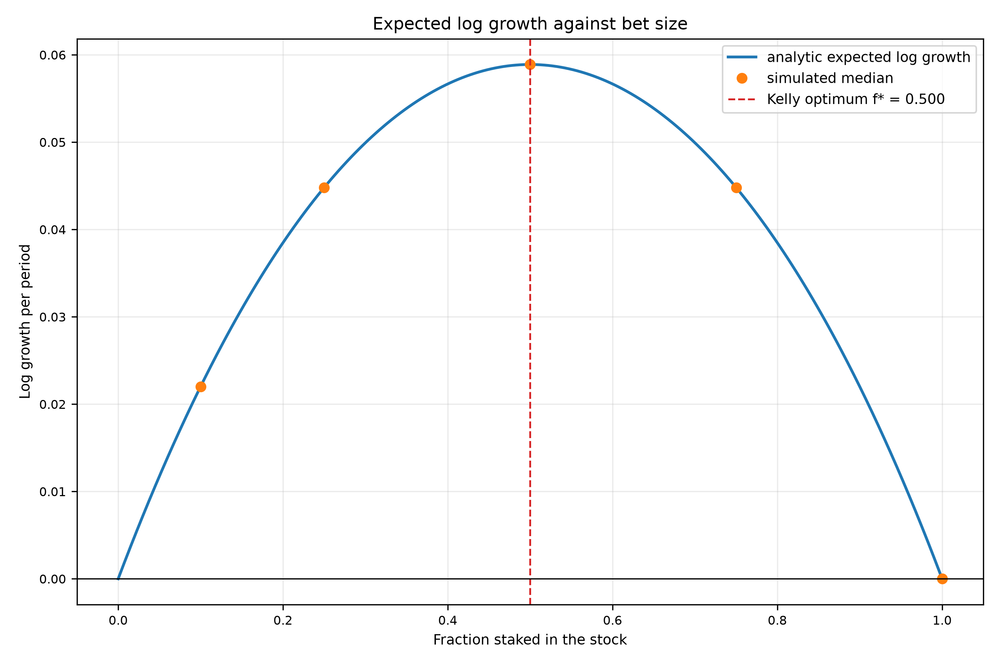
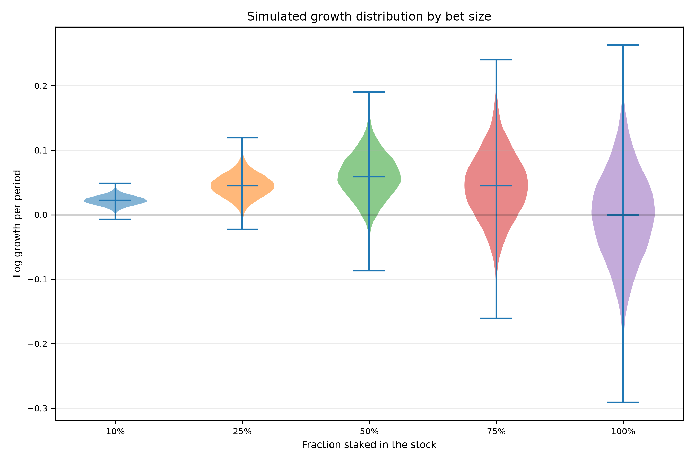

# Shannon's Demon

Rev. 4 | Created: 2026-08-29 | Updated: 2026-08-30 02:33 UTC

> **Goal** — 리밸런싱이 만드는 성장률 이득의 크기를 수치로 확정한다. "리밸런싱은 좋다" 가 아니라 "연 몇 %p 이며 거래비용 몇 bps 에서 사라지는가" 를 판단 기준으로 쓸 수 있게 한다.
>
> **Non-Goals** — 자산 3개 이상의 최적 배분, 세금·환율·leverage 모형, 종목 선택 규칙은 다루지 않는다. 실제 시세는 두 종목의 사후 표본 하나이며, 전략 추천이 아니라 모형 검증에 쓴다.
>
> **Background** — Claude Shannon 이 1966년 MIT 강연에서 제시한 예시가 출발점이다 [\[4\]](#ref-4). 기대 성장률이 0인 자산과 현금을 반씩 들고 매 기간 비중을 되돌리면 포트폴리오가 복리로 자란다는 주장이다. 이 주장은 널리 인용되지만 인용되는 수치는 대개 극단적 parameter 에서 나온 것이고, 거래비용을 뺀 값이 아니다. 이 문서는 원래 주장을 재현한 뒤, 현실적 volatility 와 거래비용에서 무엇이 남는지를 확인한다.

## 1. Pipeline

네 script 를 순서대로 실행한다. 앞 단계의 결론이 뒤 단계의 질문이 된다.

```text
shannon_demon.py    coin-flip game            -> terminal wealth samples, wealth paths
        |
        |  "50:50 이 왜 최적인가"
        v
kelly.py            growth-optimal fraction   -> growth curve, simulated growth samples
        |
        |  "현실 parameter 에서는 얼마가 남는가"
        v
rebalance_bonus.py  lognormal market          -> bonus grid, net bonus after cost, AR(1) sweep
        |
        |  "모형이 실제 시세에서도 맞는가"
        v
backtest.py         real price history        -> policy comparison, band sweep, rolling windows
```

- `shannon_demon.py` — 동전 던지기 자산과 현금을 두고, 매 기간 리밸런싱하는 포트폴리오와 buy-and-hold 를 같은 난수 위에서 비교한다.
- `kelly.py` — 1단계의 50% 비중이 임의의 선택이 아니라 기대 log 성장률을 최대화하는 값임을 closed form, 수치 최적화, Monte Carlo 세 방법으로 확인한다.
- `rebalance_bonus.py` — 같은 효과를 lognormal 자산에서 측정한다. volatility 와 correlation 에 대한 closed form 값, 거래비용을 뺀 값, 수익률에 autocorrelation 이 있을 때의 값을 각각 낸다.
- `backtest.py` — 앞 세 단계가 가정한 수익률 과정 대신 실제 시세를 읽어 같은 질문을 다시 던진다. 정기 간격과 밴드 방식을 buy-and-hold 와 비교하고, 롤링 구간으로 시기 의존성을 본다.

`kelly.py` 는 `shannon_demon.py` 의 simulator 를 import 하여 같은 게임을 돌린다. 두 script 의 수치가 어긋날 수 없는 구조이다.

## 2. Method

### 2.1 Coin-flip game

자산은 둘이다. 주식은 매 기간 확률 $p$ 로 $u$ 배, 확률 $1-p$ 로 $d$ 배가 되고, 현금은 $c$ 배가 된다. 기본값은 $u=2$, $d=0.5$, $c=1$, $p=0.5$ 이다. 주식만 들고 있으면 기하평균이 $\sqrt{u d} = 1$ 이므로 장기 성장률이 0 이다.

주식 비중을 $f$ 로 고정하고 매 기간 되돌리면, 한 기간의 포트폴리오 배수는 $f u + (1-f) c$ 또는 $f d + (1-f) c$ 가 된다. 리밸런싱을 하지 않으면 각 sleeve 가 따로 복리로 자라고 비중이 표류한다. 두 전략에 같은 동전 던지기 배열을 쓰므로, 두 결과의 차이는 난수가 아니라 운용 규칙에서만 온다.

### 2.2 Growth-optimal fraction

기대 log 성장률은 다음과 같다.

$$g(f) = p \ln\left(f u + (1-f) c\right) + (1-p) \ln\left(f d + (1-f) c\right)$$

$A = u - c$, $B = d - c$ 로 두고 $g'(f) = 0$ 을 풀면 최적 비중이 닫힌 형태로 나온다.

$$f^{*} = -\frac{c \left(p A + (1-p) B\right)}{A B}$$

이 규칙은 기대 log 자산을 최대화하는 베팅 비중을 구하는 Kelly criterion 과 같은 것이다 [\[1\]](#ref-1)[\[3\]](#ref-3). `kelly.py` 는 이 값과 `scipy.optimize.minimize_scalar` 로 구한 값을 함께 계산하고, 둘의 차이가 허용치를 넘으면 실행을 중단한다. 성장 함수나 최적화 구간이 틀렸을 때 조용히 넘어가지 않게 하기 위함이다.

정의역은 $f \lt c / (c - d)$ 로 제한한다. 이 값 이상에서는 하락이 한 번 나오면 포트폴리오가 0 이하가 되어 log 가 정의되지 않는다.

### 2.3 Rebalancing bonus in closed form

연속 리밸런싱 극한에서, 고정 비중 포트폴리오의 log 성장률은 개별 자산 log 성장률의 가중평균보다 다음만큼 크다.

$$\text{bonus} = \frac{1}{2}\left(\sum_i w_i \sigma_i^2 - \sigma_p^2\right), \qquad \sigma_p^2 = w^{\top} \Sigma w$$

이 항은 stochastic portfolio theory 에서 excess growth rate 로 불리는 양과 같다 [\[2\]](#ref-2).

두 자산의 volatility 가 같고 비중이 $w$, $1-w$ 일 때 이 값은 $w (1-w) \sigma^2 (1 - \rho)$ 로 정리된다. volatility 의 제곱에 비례하고, correlation 이 낮을수록 커진다.

이 식의 비교 대상은 buy-and-hold 가 아니라 **개별 자산 성장률의 가중평균** 이다. 둘은 다르다. buy-and-hold 는 이긴 자산의 비중이 저절로 올라가므로, 같은 격차의 일부를 스스로 벌어들인다. `rebalance_bonus.py` 는 두 기준을 모두 저장하여 이 차이가 섞이지 않게 한다.

### 2.4 Transaction cost model

거래비용은 거래된 금액에 비례하는 one-way 비용으로 둔다. 리밸런싱 시점의 거래량은 목표 비중과 현재 보유의 차이의 절대값 합이며, 매수와 매도 양쪽에 각각 부과한다. 비용은 리밸런싱 직전 자산에서 차감한 뒤 목표 비중으로 되돌린다. buy-and-hold 는 거래가 없으므로 비용도 0 이다.

`run_strategy` 는 buy-and-hold 에 0 이 아닌 비용률을 넘기면 에러를 낸다. 거래하지 않는 전략에 거래비용을 붙이는 것은 호출자의 모순이지 기본값으로 덮을 일이 아니다.

### 2.5 Autocorrelation and its normalization

수익률이 독립이라는 가정을 풀기 위해 log 수익률에 AR(1) 을 준다. 계수 $\phi$ 가 양이면 추세가, 음이면 평균회귀가 생긴다.

여기에는 답이 갈리는 선택이 하나 있다. $\phi$ 를 바꿀 때 `--annual-volatility` 가 무엇을 고정하는가이다.

- `step` — 한 기간의 volatility 를 고정한다. 추세가 있으면 장기 volatility 가 함께 커지므로, $\phi$ 를 올리면 수확할 변동성 자체가 늘어난다.
- `horizon` — 누적 log 수익률의 1년 volatility 를 고정한다. $\phi$ 는 같은 양의 위험을 기간 사이에 재배치할 뿐이므로, 추세와 평균회귀의 효과만 남는다.

AR(1) 항 $n$ 개의 합의 분산은 독립 표본 대비 $(1+\phi)/(1-\phi)$ 배가 되므로, `horizon` 은 한 기간 volatility 에 $\sqrt{(1-\phi)/(1+\phi)}$ 를 곱해 이를 상쇄한다. 두 선택은 부호가 반대인 답을 주기 때문에 CLI option 으로 노출하고 기본값을 `horizon` 으로 둔다. 추세와 평균회귀를 가려내려는 질문에 맞는 쪽이 `horizon` 이기 때문이다.

$\phi$ 를 바꿀 때마다 난수 generator 를 seed 로 되감아 모든 $\phi$ 가 같은 shock 을 필터링하게 한다. $\phi$ 사이의 비교가 뽑기 운이 아니라 filter 의 효과만 반영하게 하기 위함이다.

### 2.6 Backtest on real prices

가격 file 은 종목당 하나의 csv 로 읽고, 모든 종목에 공통으로 존재하는 날짜만 남겨 정렬한다. 수익률은 split 과 배당이 반영된 조정 종가에서 계산한다. 조정하지 않은 종가를 쓰면 split 이 폭락으로 잡혀 결과가 무너진다.

정기 간격은 2.4 절의 비용 모형을 그대로 쓴다. 밴드 방식은 목표 비중에서 가장 많이 벗어난 비중이 밴드 폭을 넘을 때만 거래하며, 넘지 않으면 확인만 하고 지나간다.

`RebalancePolicy` 는 생성자를 직접 부르지 않고 buy-and-hold, calendar, band 세 factory 로만 만든다. 간격과 밴드 폭은 서로 다른 규칙의 parameter 이므로, 하나의 dataclass 가 둘을 함께 받으면 밴드 정책에 간격을 넘겨도 조용히 무시될 수 있다. 표현 자체를 불가능하게 만들어 그 오류를 없앤다.

출처는 CLI 필수 인자이며 결과 folder 의 `data_provenance.json` 에 그대로 기록된다. 수치가 출처와 분리되지 않게 하기 위함이다.

## 3. Input

앞 세 script 는 외부 자료를 읽지 않는다. 모든 입력은 CLI option 으로 주어지는 parameter 이며, 자료는 seed 가 고정된 generator 에서 생성한다. 같은 seed 와 같은 option 이면 결과가 재현된다.

Table 1. Coin-flip game parameters used by `shannon_demon.py` and `kelly.py`
| Parameter | Value | Meaning |
|---|---|---|
| `--up-factor` | 2.0 | 상승 시 주식 배수 |
| `--down-factor` | 0.5 | 하락 시 주식 배수 |
| `--cash-factor` | 1.0 | 현금 배수 |
| `--up-prob` | 0.5 | 상승 확률 |
| `--stock-weight` | 0.5 | 주식 목표 비중 |
| `--n-periods` | 100 | 경로당 기간 수 |
| `--n-paths` | 20,000 | Monte Carlo 경로 수 |
| `--seed` | 20260829 | 난수 seed |

Table 2. Lognormal market parameters used by `rebalance_bonus.py`
| Parameter | Value | Meaning |
|---|---|---|
| `--annual-drift` | 0.05 | 자산별 연 log drift |
| `--annual-volatility` | 0.20 | 자산별 연 volatility |
| `--correlation` | 0.20 | 두 자산 간 correlation |
| `--stock-weight` | 0.50 | 첫 자산 목표 비중 |
| `--steps-per-year` | 252 | 연간 simulation 단계 수 |
| `--n-years` | 20 | 경로 길이 |
| `--n-paths` | 1,000 | Monte Carlo 경로 수 |
| `--rebalance-intervals` | 1 5 21 63 126 252 | 리밸런싱 간격, 단계 수 |
| `--cost-bps` | 0 5 10 25 50 | one-way 거래비용 수준 |
| `--phi-grid` | -0.30 ~ +0.30 | AR(1) 계수 9개 |
| `--autocorr-normalization` | horizon | volatility 고정 기준 |

`backtest.py` 만 외부 자료를 읽는다. 자료는 Kaggle 의 Stock Market Dataset 이며, 그 dataset 자체는 Yahoo Finance 에서 수집된 2020-04-02 snapshot 이다.

Table 3. Price data read by `backtest.py`
| Item | Value |
|---|---|
| Tickers | AAPL, AMZN |
| Price column | `Adj Close`, split 과 배당 반영 |
| Common period | 1997-05-15 to 2020-04-01 |
| Aligned rows | 5,758 |
| Target weights | 0.50 / 0.50 |
| Rolling window | 10 years, 21-day stride, 5 bps cost |

## 4. Output

산출물은 `--output-folder` 아래 script 이름 folder 로 나뉜다. 아래는 이 문서가 인용하는 실행의 구조이다.

```text
Shannons_Demon_fig/
├── shannon_demon/
│   ├── terminal_wealth.csv
│   ├── wealth_paths.csv
│   ├── wealth_paths.png
│   └── growth_distribution.png
├── kelly/
│   ├── growth_curve.csv
│   ├── simulated_log_growth.csv
│   ├── growth_curve.png
│   └── growth_violin.png
└── rebalance_bonus/
    ├── bonus_grid.csv
    ├── frequency_net_bonus.csv
    ├── autocorrelation_effect.csv
    ├── bonus_heatmap.png
    ├── frequency_net_bonus.png
    └── autocorrelation_effect.png
```

### 4.1 Files from `shannon_demon.py`

- `terminal_wealth.csv` — 1 file, shape (40,000 × 4). 1 row = 1 path × 1 strategy.
- `wealth_paths.csv` — 1 file, shape (8,080 × 4). 1 row = 1 path × 1 period × 1 strategy.
- `wealth_paths.png` — 1 file.
- `growth_distribution.png` — 1 file.

### 4.2 Files from `kelly.py`

- `growth_curve.csv` — 1 file, shape (401 × 3). 1 row = 1 fraction on the grid.
- `simulated_log_growth.csv` — 1 file, shape (100,000 × 3). 1 row = 1 path × 1 fraction.
- `growth_curve.png` — 1 file.
- `growth_violin.png` — 1 file.

### 4.3 Files from `rebalance_bonus.py`

- `bonus_grid.csv` — 1 file, shape (63 × 3). 1 row = 1 volatility × 1 correlation.
- `frequency_net_bonus.csv` — 1 file, shape (30,000 × 9). 1 row = 1 path × 1 rebalancing interval × 1 cost level.
- `autocorrelation_effect.csv` — 1 file, shape (9,000 × 5). 1 row = 1 path × 1 AR(1) coefficient.
- `bonus_heatmap.png` — 1 file.
- `frequency_net_bonus.png` — 1 file.
- `autocorrelation_effect.png` — 1 file.

### 4.4 Files from `backtest.py`

- `data_provenance.json` — 1 file. 출처, 읽은 file, 정렬된 기간.
- `aligned_prices.csv` — 1 file, shape (5,758 × 3). 1 row = 1 date.
- `strategy_wealth.csv` — 1 file, shape (23,028 × 3). 1 row = 1 date × 1 strategy.
- `policy_cost_sweep.csv` — 1 file, shape (55 × 12). 1 row = 1 policy × 1 cost level.
- `rolling_windows.csv` — 1 file, shape (310 × 8). 1 row = 1 window × 1 policy.
- `wealth_curves.png` — 1 file.
- `policy_cost_sweep.png` — 1 file.
- `band_comparison.png` — 1 file.
- `rolling_windows.png` — 1 file.

분포를 그리는 figure 는 요약값이 아니라 표본을 저장한다. 이 문서의 모든 수치는 위 csv 에서 계산했으며 figure 에서 눈으로 읽은 값이 아니다.

## 5. Result

### 5.1 Coin-flip game

Table 4. Terminal wealth after 100 periods, 20,000 paths, from `terminal_wealth.csv`
| Strategy | Median terminal wealth | Mean terminal wealth | Median return per period | 5th percentile | 95th percentile | Loss probability |
|---|---|---|---|---|---|---|
| rebalanced | 361.0989 | 8.130e+04 | +6.0660% | 1.411 | 9.244e+04 | 0.04555 |
| buy_and_hold | 1.0000 | 7.217e+06 | +0.0000% | 0.500 | 3.277e+04 | 0.46685 |

주식 단독의 기대 log 성장률은 정확히 0 이다. buy-and-hold 의 기간당 중앙 수익률은 +0.0000% 로 이 값과 일치하며 중앙 최종자산은 1.0000 이다. 리밸런싱 포트폴리오의 중앙 최종자산은 361.0989 로 기간당 +6.0660% 이다. 평균은 두 전략 모두 중앙값보다 몇 자릿수 크며, buy-and-hold 쪽이 더 크다.


Fig 1. Sampled wealth paths of both strategies on a log scale


Fig 2. Distribution of log growth per period over 20,000 paths

### 5.2 Growth-optimal fraction

closed form 최적 비중은 0.500000, 수치 최적화 값도 0.500000 이며 둘의 차이는 3.33e-16 이다.

Table 5. Growth rate by stock fraction, from `growth_curve.csv` and `simulated_log_growth.csv`
| Fraction | Analytic log growth | Analytic return per period | Simulated median | Loss probability |
|---|---|---|---|---|
| 10% | +0.022008 | +2.2252% | +0.022008 | 0.00085 |
| 25% | +0.044806 | +4.5825% | +0.044806 | 0.00665 |
| 40% | +0.056664 | +5.8301% | — | — |
| 50% | +0.058892 | +6.0660% | +0.058892 | 0.04320 |
| 60% | +0.056664 | +5.8301% | — | — |
| 75% | +0.044806 | +4.5825% | +0.044806 | 0.18680 |
| 100% | +0.000000 | +0.0000% | +0.000000 | 0.45305 |

40% 와 60% 는 해석해 격자에만 있고 시뮬레이션 대상 비중이 아니므로 두 열을 `—` 로 둔다.

시뮬레이션 중앙값은 해석해와 소수점 여섯 자리까지 일치한다. 곡선은 $f^{*}$ 근처에서 평평하다. 비중을 40% 나 60% 로 두어도 기간당 수익은 5.8301% 로 최적값 6.0660% 에서 0.2359 %p 만 낮다. 반대쪽에서 손실 확률은 단조로 오른다. 50% 에서 0.04320, 75% 에서 0.18680, 100% 에서 0.45305 이다.


Fig 3. Expected log growth against bet size, with the simulated medians overlaid


Fig 4. Simulated growth distribution by bet size

### 5.3 Gross bonus at realistic parameters

Table 6. Closed-form gross bonus in %p of annual log growth, from `bonus_grid.csv`
| Annual volatility | rho = -0.90 | rho = 0.00 | rho = +0.90 |
|---|---|---|---|
| 10% | 0.47 | 0.25 | 0.03 |
| 20% | 1.90 | 1.00 | 0.10 |
| 60% | 17.10 | 9.00 | 0.90 |

기본 parameter ( volatility 20%, correlation +0.20 ) 에서 closed form 값은 0.8000 %p 이다. 일간 리밸런싱 simulation 이 개별 자산 성장률의 가중평균 대비 얻은 값은 0.8006 %p 로, 두 값의 차이는 0.0006 %p 이다. 같은 실행에서 buy-and-hold 가 비중 표류만으로 같은 기준 대비 얻은 값은 0.3459 %p 이다.


Fig 5. Gross rebalancing bonus over volatility and correlation

### 5.4 Net bonus after transaction cost

Table 7. Median CAGR advantage over buy-and-hold in %p, from `frequency_net_bonus.csv`
| Rebalancing interval | 0 bps | 5 bps | 10 bps | 25 bps | 50 bps |
|---|---|---|---|---|---|
| daily (1) | +0.4752 | +0.3914 | +0.3049 | +0.0544 | -0.3704 |
| weekly (5) | +0.4746 | +0.4365 | +0.3981 | +0.2843 | +0.0961 |
| monthly (21) | +0.4645 | +0.4455 | +0.4267 | +0.3714 | +0.2806 |
| quarterly (63) | +0.4610 | +0.4503 | +0.4397 | +0.4089 | +0.3568 |
| semiannual (126) | +0.4156 | +0.4091 | +0.4025 | +0.3808 | +0.3422 |
| annual (252) | +0.3621 | +0.3566 | +0.3512 | +0.3351 | +0.3072 |

Table 8. Turnover, break-even cost and win rate by rebalancing interval, from `frequency_net_bonus.csv`
| Rebalancing interval | Median annual turnover | Break-even cost | Win rate at 0 bps |
|---|---|---|---|
| daily (1) | 1.6033 | 28.1 bps | 0.6900 |
| weekly (5) | 0.7169 | 62.7 bps | 0.6900 |
| monthly (21) | 0.3488 | 126.5 bps | 0.6900 |
| quarterly (63) | 0.2004 | 221.7 bps | 0.6810 |
| semiannual (126) | 0.1419 | 282.1 bps | 0.6860 |
| annual (252) | 0.0995 | 330.3 bps | 0.6770 |

거래비용이 0 일 때 이득은 간격에 거의 무관하다. 일간 +0.4752 %p 에서 연간 +0.3621 %p 사이이다. 비용이 붙으면 순서가 바뀐다. 50 bps 에서 일간 리밸런싱은 -0.3704 %p 로 부호가 바뀌고, 분기 리밸런싱이 +0.3568 %p 로 가장 높다. 손익분기 비용은 일간 28.1 bps 에서 연간 330.3 bps 까지 벌어진다. 비용이 0 이어도 이득이 양수인 경로의 비율은 어느 간격에서나 0.68 에서 0.69 사이이다.


Fig 6. Net rebalancing bonus after transaction cost

### 5.5 Autocorrelation

Table 9. Median CAGR advantage in %p by AR(1) coefficient under `horizon` normalization, from `autocorrelation_effect.csv`
| AR(1) coefficient | Median advantage | 25th percentile | 75th percentile |
|---|---|---|---|
| -0.30 | +0.4958 | -0.1672 | +0.7616 |
| -0.20 | +0.4853 | -0.1758 | +0.7517 |
| -0.10 | +0.4741 | -0.1876 | +0.7445 |
| -0.05 | +0.4692 | -0.1930 | +0.7403 |
| 0.00 | +0.4645 | -0.1982 | +0.7353 |
| +0.05 | +0.4599 | -0.2035 | +0.7304 |
| +0.10 | +0.4539 | -0.2079 | +0.7264 |
| +0.20 | +0.4489 | -0.2145 | +0.7158 |
| +0.30 | +0.4422 | -0.2202 | +0.7044 |

중앙값은 $\phi$ 에 대해 단조 감소한다. $\phi = -0.30$ 에서 +0.4958 %p, $\phi = +0.30$ 에서 +0.4422 %p 로 범위 전체에서 0.0536 %p 움직인다. 같은 범위에서 사분위 구간은 폭이 0.9 %p 를 넘고 아래쪽 사분위수는 모든 $\phi$ 에서 음수이다.


Fig 7. Rebalancing advantage against return autocorrelation

### 5.6 Backtest on real prices

표본 기간의 실현 volatility 는 AAPL 45.01%, AMZN 58.49% 이고 correlation 은 0.3006 이다. 이 값을 2.3 절의 식에 넣으면 closed form 보너스는 4.8309 %p 이다. 같은 기간 일간 리밸런싱이 개별 자산 성장률의 가중평균 대비 실제로 얻은 값은 4.8219 %p 로, 차이는 0.0090 %p 이다.

가중평균 자산 CAGR 은 +32.8062%, buy-and-hold 는 +33.2599% 로, buy-and-hold 가 비중 표류만으로 얻은 값은 0.3411 %p 이다.

Table 10. CAGR advantage over buy-and-hold in %p by policy and cost, from `policy_cost_sweep.csv`
| Policy | 0 bps | 5 bps | 10 bps | 25 bps | 50 bps | Annual turnover |
|---|---|---|---|---|---|---|
| daily | +6.1070 | +5.8963 | +5.6859 | +5.0567 | +4.0141 | 3.0260 |
| weekly | +6.2330 | +6.1300 | +6.0272 | +5.7189 | +5.2066 | 1.4768 |
| monthly | +5.0349 | +4.9863 | +4.9377 | +4.7921 | +4.5496 | 0.7029 |
| quarterly | +4.6089 | +4.5820 | +4.5550 | +4.4741 | +4.3393 | 0.3914 |
| semiannual | +4.7196 | +4.6990 | +4.6784 | +4.6166 | +4.5137 | 0.2985 |
| annual | +6.0647 | +6.0493 | +6.0340 | +5.9879 | +5.9112 | 0.2203 |
| band 1% | +6.0375 | +5.8953 | +5.7532 | +5.3277 | +4.6213 | 2.0435 |
| band 2% | +6.0713 | +5.9713 | +5.8714 | +5.5722 | +5.0748 | 1.4352 |
| band 5% | +6.2776 | +6.2248 | +6.1719 | +6.0135 | +5.7498 | 0.7577 |
| band 10% | +5.8037 | +5.7757 | +5.7476 | +5.6635 | +5.5233 | 0.4035 |
| band 20% | +5.7407 | +5.7269 | +5.7131 | +5.6715 | +5.6023 | 0.1991 |


Fig 8. Wealth curves of the sampled policies on a log scale


Fig 9. Net advantage of each calendar interval against transaction cost


Fig 10. Advantage against turnover, calendar versus band rebalancing

모든 정책이 모든 비용 수준에서 양수이며, 최소값은 일간 리밸런싱의 50 bps 에서 +4.0141 %p 이다. 회전율 대비 이득이 가장 좋은 것은 밴드 5% 로, 회전율 0.7577 에 50 bps 에서 +5.7498 %p 이다. 같은 회전율대의 월간 리밸런싱은 회전율 0.7029 에 +4.5496 %p 이다.

Table 11. Advantage in %p over 10-year rolling windows at 5 bps, from `rolling_windows.csv`
| Policy | Windows | Median | 25th percentile | 75th percentile | Worst | Best | Win rate |
|---|---|---|---|---|---|---|---|
| band 5% | 155 | +1.7539 | +0.6641 | +3.0945 | -4.0140 | +13.4372 | 0.8000 |
| quarterly | 155 | +1.3864 | +0.2569 | +2.2629 | -4.1883 | +14.1212 | 0.7677 |


Fig 11. Rebalancing advantage over rolling 10-year windows

두 정책 모두 사분위 구간의 아래쪽 끝이 양수여서, 구간을 언제 시작하든 중앙값 근처가 유지된다. 그러나 최악과 최선의 폭이 18 %p 를 넘고 구간의 다섯 중 하나 이상에서 이득이 음수이다.

## 6. Analysis

### 6.1 What the coin-flip game does and does not show

Shannon 의 주장은 재현된다. 기대 성장률이 0 인 자산과 현금을 반씩 들고 되돌리는 것만으로 기간당 6% 가 넘는 복리 성장이 나온다. 다만 이 수치를 만드는 것은 리밸런싱이 아니라 자산의 변동성 크기이다. 배수가 2배와 반토막이라는 설정은 실제 시장에 없다. Table 6 가 보이듯 보너스는 volatility 의 제곱에 비례하므로, volatility 를 20% 로 낮추면 같은 원리에서 나오는 값은 1.00 %p 수준으로 떨어진다.

Table 4 의 평균과 중앙값 차이도 같은 이야기를 한다. buy-and-hold 의 평균이 리밸런싱 포트폴리오의 평균보다 큰 것은 극히 드문 우측 꼬리 때문이며, 경로의 절반 가까이는 원금을 잃는다. 산술평균으로 전략을 고르면 정반대의 결론에 이른다.

### 6.2 The closed form measures a different comparison

5.3 절의 세 수치가 이 문서에서 가장 실용적인 부분이다. closed form 0.8000 %p 는 simulation 값 0.8006 %p 와 사실상 일치하지만, 그 비교 대상은 buy-and-hold 가 아니라 개별 자산 성장률의 가중평균이다. buy-and-hold 자체가 비중 표류만으로 같은 기준 대비 0.3459 %p 를 벌기 때문에, 실제로 buy-and-hold 를 상대로 얻는 이득은 Table 7 의 0.46 %p 수준이다.

교과서 공식을 그대로 인용하면 실제 이득을 약 1.7배 부풀리게 된다. 두 자산의 parameter 가 같은 이 설정에서 buy-and-hold 의 장기 성장률은 가중평균이 아니라 더 잘한 자산 쪽으로 수렴하기 때문이다.

### 6.3 Cost decides the frequency, not the theory

Table 7 과 Table 8 을 함께 보면 실행 규칙이 나온다. 무비용 이득은 간격에 거의 무관한데 회전율은 간격에 크게 반응하므로, 최적 간격은 이론이 아니라 비용이 정한다. 개인 투자자에게 흔한 25 bps 수준에서는 분기 리밸런싱이 가장 낫고, 50 bps 에서는 일간 리밸런싱이 손해로 바뀐다. 손익분기 비용이 일간과 연간 사이에서 열 배 이상 벌어진다는 것이 이 표의 요지이다.

이 계산에는 세금이 없다. 과세 계좌에서 리밸런싱은 실현 손익을 만들므로 실효 비용은 위의 bps 보다 크다. 이 문서의 손익분기 값은 상한으로 읽어야 한다.

### 6.4 Autocorrelation moves the sign but not the magnitude

방향은 통념과 맞는다. 평균회귀에서 이득이 커지고 추세에서 작아진다. 그러나 Table 9 에서 $\phi$ 를 -0.30 에서 +0.30 까지 움직여도 중앙값은 0.0536 %p 만 변한다. 같은 표의 사분위 폭 0.9 %p 에 비하면 무시할 만한 크기이다.

이 결과는 각 자산이 자기 수익률에 대해 갖는 autocorrelation 만 다룬다. 리밸런싱을 실제로 해치는 것으로 알려진 것은 두 자산 사이의 상대 모멘텀, 즉 한쪽이 계속 이기는 상황이며 이 모형은 그것을 담지 않는다. 두 자산에 같은 $\phi$ 를 주면 상대 수익률도 같은 $\phi$ 를 물려받아 효과가 상쇄되기 때문이다.

또한 2.5 절의 두 normalization 이 반대 부호를 준다는 점을 기억해야 한다. `step` 을 쓰면 추세가 이득을 키우는 것으로 나온다. 그 경우 커지는 것은 리밸런싱의 효율이 아니라 장기 volatility 자체이다. 문헌에서 부호가 엇갈리는 보고가 나오는 이유의 하나가 이 지점이다.

### 6.5 The model holds on real prices, but the sample is two winners

5.6 절의 첫 두 수치가 이 문서에서 가장 강한 검증이다. 2.3 절의 식은 lognormal 이고 독립인 수익률을 가정하는데, 팻테일과 volatility clustering 이 가득한 23년치 실제 시세에서 예측값과 실현값이 0.0090 %p 안에서 만났다. 보너스의 크기를 정하는 것은 수익률 분포의 세부 모양이 아니라 volatility 와 correlation 두 값이라는 뜻이다.

Table 10 의 이득이 6.1 절의 1.00 %p 보다 훨씬 큰 이유도 같은 식으로 설명된다. 두 종목의 volatility 가 45% 와 58% 로 20% 가정의 두 배 이상이고 보너스는 그 제곱에 비례한다. 이것은 리밸런싱이 실제로 더 잘 듣는다는 뜻이 아니라, 변동성이 큰 자산을 골랐다는 뜻이다.

6.3 절에서 시뮬레이션이 준 규칙은 실제 시세에서 부분적으로만 재현된다. 비용이 오를수록 회전율이 낮은 정책이 유리해지는 방향은 같지만, Table 10 에서 가장 높은 것은 분기가 아니라 밴드 5% 이고 연간 리밸런싱도 상위권이다. 이 표본의 두 종목이 몇 년 단위의 큰 등락을 겪었기 때문에, 그 주기에 맞는 정책이 유리하게 나온 것이다. 최적 정책은 표본에 따라 달라지며 일반화되지 않는다.

밴드 방식이 6.6 절에서 다음 단계로 적었던 대로 작동한다는 점은 확인된다. 밴드 5% 는 월간 리밸런싱과 회전율이 비슷하면서 모든 비용 수준에서 더 높다. 거래 시점을 달력이 아니라 실제 이탈 정도가 정하기 때문이다.

다만 이 표본은 두 종목이며, 둘 다 사후에 크게 오른 종목이다. Table 11 이 보여주듯 구간의 20% 이상에서는 이득이 음수이고 최악 구간은 -4 %p 를 넘는다. 하나의 표본에서 나온 +5 %p 대의 수치는 기대값이 아니라 이 두 종목의 이 기간에 대한 사실로만 읽어야 한다.

### 6.6 Limits and next steps

- 자산 2개, parameter 동일, correlation 상수라는 설정. 실제 포트폴리오의 자산은 volatility 와 기대수익이 서로 다르고 correlation 은 시기에 따라 변한다.
- 정규분포 가정. 팻테일과 volatility clustering 이 없으므로 위기 구간에서 리밸런싱이 겪는 실제 손실이 과소평가된다.
- 세금과 호가 스프레드 미반영. 6.3 절에서 적었듯 손익분기 비용은 상한이다.
- 실제 시세 표본이 종목 2개, 기간 1개. 사후에 크게 오른 종목이므로 생존 편향이 있다.

다음 단계로는 상대 모멘텀을 직접 모형에 넣어 6.4 절의 미해결 부분을 확인하는 것, 그리고 backtest 를 여러 종목 조합으로 반복해 Table 10 의 정책 순위가 표본에 얼마나 의존하는지 보는 것이 가장 값이 크다. 후자는 6.5 절에서 일반화되지 않는다고 적은 부분을 수치로 확인해 준다.

## References

<a id="ref-1"></a>
[1] Kelly, J. L. Jr. "A New Interpretation of Information Rate." Bell System Technical Journal 35, no. 4 (1956): 917–926. DOI 10.1002/j.1538-7305.1956.tb03809.x

<a id="ref-2"></a>
[2] Fernholz, R., and B. Shay. "Stochastic Portfolio Theory and Stock Market Equilibrium." Journal of Finance 37, no. 2 (1982): 615–624. DOI 10.1111/j.1540-6261.1982.tb03584.x

<a id="ref-3"></a>
[3] Thorp, E. O. "The Kelly Criterion in Blackjack, Sports Betting, and the Stock Market." In Handbook of Asset and Liability Management, Volume 1, 385–428. North-Holland, 2006. DOI 10.1016/S1872-0978(06)01009-X

<a id="ref-4"></a>
[4] Poundstone, W. Fortune's Formula: The Untold Story of the Scientific Betting System That Beat the Casinos and Wall Street. Hill and Wang, 2005. ISBN 978-0-8090-4599-0

---

## Appendix A. Terminology

- **AR(1)** — 현재 값이 직전 값의 상수배에 새 잡음을 더한 값이 되는 1차 자기회귀 과정. 계수가 양이면 추세, 음이면 평균회귀를 만든다.
- **band rebalancing** — 목표 비중에서 정한 폭 이상 벗어났을 때만 거래하는 방식. 달력이 아니라 이탈 정도가 거래 시점을 정한다.
- **bps** — basis point. 0.01% 이다.
- **buy-and-hold** — 최초 비중으로 매수한 뒤 거래하지 않는 운용. 비중은 자산의 성과에 따라 표류한다.
- **CAGR** — compound annual growth rate. 기간 수익을 연 복리 수익률로 환산한 값.
- **Kelly criterion** — 기대 log 자산을 최대화하는 베팅 비중을 구하는 규칙.
- **rebalancing bonus** — 고정 비중 포트폴리오의 log 성장률이 개별 자산 log 성장률의 가중평균을 넘는 부분.
- **Shannon's Demon** — 기대 성장률이 0인 자산과 현금을 정기적으로 리밸런싱하면 포트폴리오가 성장한다는 예시에 붙은 이름.
- **sleeve** — 포트폴리오를 자산별로 나눈 한 칸. 리밸런싱은 sleeve 사이에서 금액을 옮기는 일이다.
- **survivorship bias** — 결과를 알고 고른 표본 때문에 성과가 실제보다 좋아 보이는 편향.
- **turnover** — 한 해 동안 거래된 금액을 포트폴리오 규모로 나눈 값.
- **variance drag** — 변동성 때문에 기하평균 수익률이 산술평균 수익률보다 낮아지는 현상.
- **%p** — percentage point. 두 비율의 차이를 나타내는 단위.

## Appendix B. CLI (Command Line Options)

네 script 모두 option 없이 실행하면 이름과 version 을 출력하고, `-h` 로 전체 목록을, `-v` 로 version 을 보인다. `--output-folder` 는 필수이며 모든 산출물의 root 가 된다. 아래 명령은 이 문서가 있는 folder 를 기준으로 한다.

```bash
python3 src/shannon_demon.py   --output-folder Shannons_Demon_fig
python3 src/kelly.py           --output-folder Shannons_Demon_fig
python3 src/rebalance_bonus.py --output-folder Shannons_Demon_fig
python3 src/backtest.py        --output-folder Shannons_Demon_fig \
    --price-folder <PRICE_FOLDER> --tickers AAPL AMZN --price-column "Adj Close" \
    --source-name "<DATASET_NAME>" --source-url "<DATASET_URL>" --source-origin "<ORIGIN>"
```

`kelly.py` 는 `shannon_demon.py` 를 import 하므로 두 파일은 같은 folder 에 있어야 한다. `backtest.py` 는 다른 script 를 import 하지 않으며, 가격 file 을 읽기만 하고 내려받지 않는다.

Table 12. CLI options of `shannon_demon.py`
| Option | Type | Default | Required | Description |
|---|---|---|---|---|
| `--output-folder` | path | — | yes | 산출물 root |
| `--up-factor` | float | 2.0 | no | 상승 시 주식 배수 |
| `--down-factor` | float | 0.5 | no | 하락 시 주식 배수 |
| `--cash-factor` | float | 1.0 | no | 현금 배수 |
| `--up-prob` | float | 0.5 | no | 상승 확률 |
| `--stock-weight` | float | 0.5 | no | 주식 목표 비중 |
| `--n-periods` | int | 100 | no | 경로당 기간 수 |
| `--n-paths` | int | 20000 | no | 경로 수 |
| `--chunk-size` | int | 4000 | no | 한 번에 계산할 경로 수 |
| `--n-sample-paths` | int | 40 | no | 경로 figure 에 그릴 경로 수 |
| `--seed` | int | 20260829 | no | 난수 seed |

Table 13. CLI options of `kelly.py`
| Option | Type | Default | Required | Description |
|---|---|---|---|---|
| `--output-folder` | path | — | yes | 산출물 root |
| `--up-factor` | float | 2.0 | no | 상승 시 주식 배수 |
| `--down-factor` | float | 0.5 | no | 하락 시 주식 배수 |
| `--cash-factor` | float | 1.0 | no | 현금 배수 |
| `--up-prob` | float | 0.5 | no | 상승 확률 |
| `--max-fraction` | float | 1.0 | no | 성장 곡선 격자의 최대 비중 |
| `--grid-points` | int | 401 | no | 성장 곡선 격자점 수 |
| `--sim-fractions` | float list | 0.10 0.25 0.50 0.75 1.00 | no | violin figure 에 쓸 비중 |
| `--n-periods` | int | 100 | no | 경로당 기간 수 |
| `--n-paths` | int | 20000 | no | 비중당 경로 수 |
| `--chunk-size` | int | 4000 | no | 한 번에 계산할 경로 수 |
| `--seed` | int | 20260829 | no | 난수 seed |

Table 14. CLI options of `rebalance_bonus.py`
| Option | Type | Default | Required | Description |
|---|---|---|---|---|
| `--output-folder` | path | — | yes | 산출물 root |
| `--annual-drift` | float | 0.05 | no | 자산별 연 log drift |
| `--annual-volatility` | float | 0.20 | no | 자산별 연 volatility |
| `--correlation` | float | 0.20 | no | 두 자산 간 correlation |
| `--stock-weight` | float | 0.50 | no | 첫 자산 목표 비중 |
| `--steps-per-year` | int | 252 | no | 연간 단계 수 |
| `--n-years` | int | 20 | no | 경로 길이 |
| `--n-paths` | int | 1000 | no | 경로 수 |
| `--rebalance-intervals` | int list | 1 5 21 63 126 252 | no | 리밸런싱 간격 |
| `--cost-bps` | float list | 0 5 10 25 50 | no | one-way 거래비용 |
| `--phi-grid` | float list | -0.30 ~ +0.30 | no | AR(1) 계수 |
| `--autocorr-interval` | int | 21 | no | AR(1) sweep 의 리밸런싱 간격 |
| `--autocorr-cost-bps` | float | 0.0 | no | AR(1) sweep 의 거래비용 |
| `--autocorr-normalization` | choice | horizon | no | `step` 또는 `horizon` |
| `--sigma-grid` | float list | 0.05 ~ 0.60 | no | 보너스 격자의 volatility |
| `--rho-grid` | float list | -0.90 ~ +0.90 | no | 보너스 격자의 correlation |
| `--seed` | int | 20260829 | no | 난수 seed |

Table 15. CLI options of `backtest.py`
| Option | Type | Default | Required | Description |
|---|---|---|---|---|
| `--output-folder` | path | — | yes | 산출물 root |
| `--price-folder` | path | — | yes | 종목당 csv 가 든 folder |
| `--tickers` | str list | — | yes | 보유 종목, 최소 2개 |
| `--weights` | float list | equal | no | 목표 비중 |
| `--date-column` | str | Date | no | 날짜 열 이름 |
| `--price-column` | str | Close | no | 가격 열 이름, 조정 종가 권장 |
| `--date-format` | str | inferred | no | 날짜 형식, 모호하면 지정 |
| `--source-name` | str | — | yes | 자료 dataset 이름 |
| `--source-url` | str | — | yes | 자료 dataset 주소 |
| `--source-origin` | str | — | yes | 그 dataset 의 원 출처 |
| `--rebalance-intervals` | int list | 1 5 21 63 126 252 | no | 정기 간격 |
| `--band-widths` | float list | 0.01 ~ 0.20 | no | 밴드 폭 |
| `--cost-bps` | float list | 0 5 10 25 50 | no | one-way 거래비용 |
| `--rolling-years` | int | 10 | no | 롤링 구간 길이 |
| `--rolling-stride-days` | int | 21 | no | 롤링 구간 시작 간격 |
| `--rolling-cost-bps` | float | 5.0 | no | 롤링 구간의 거래비용 |
| `--trading-days-per-year` | int | 252 | no | 연환산에 쓰는 거래일 수 |
