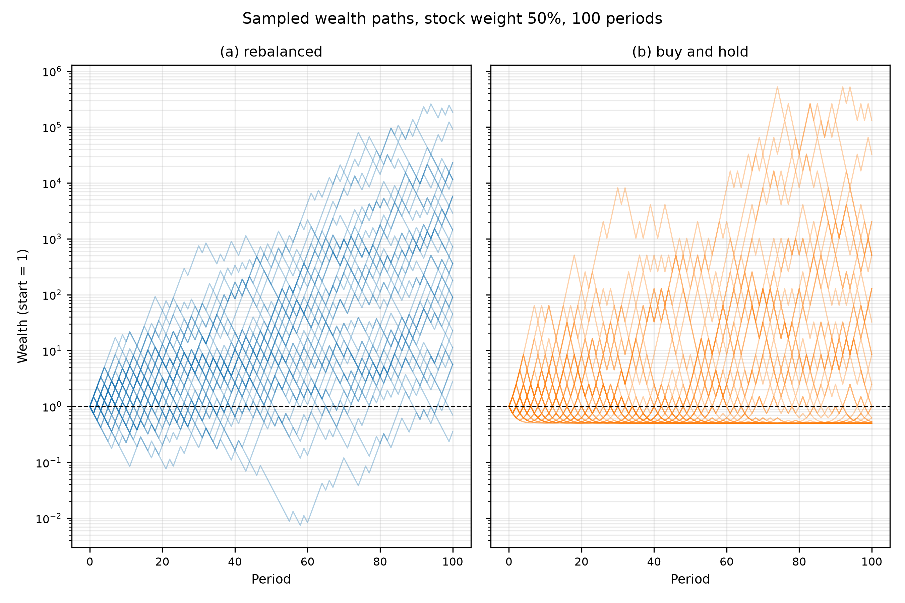
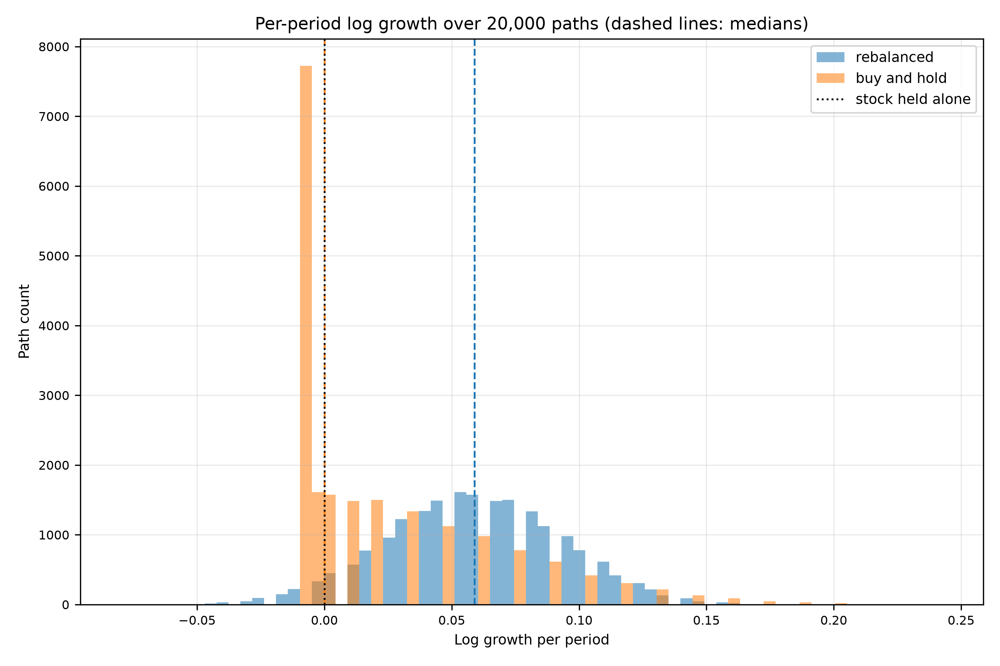
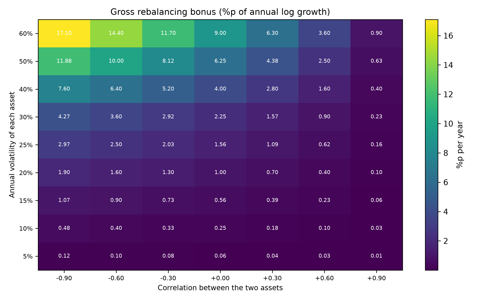
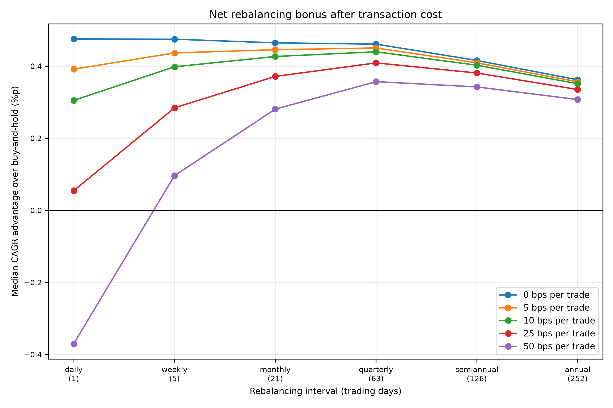
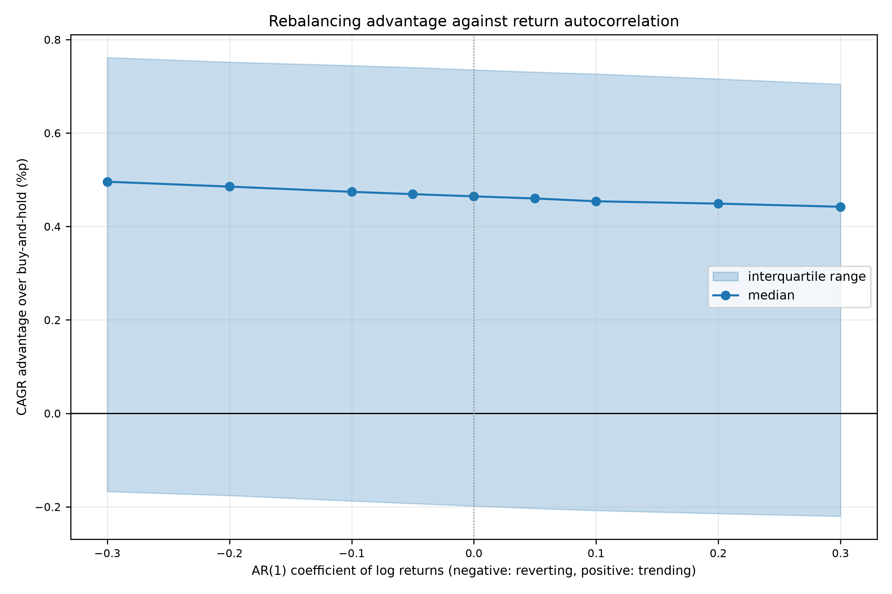
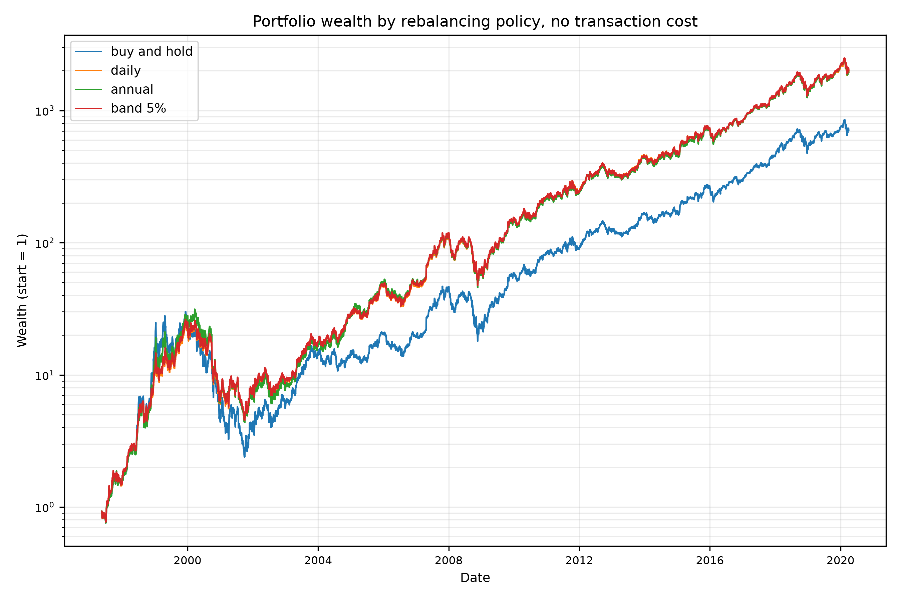
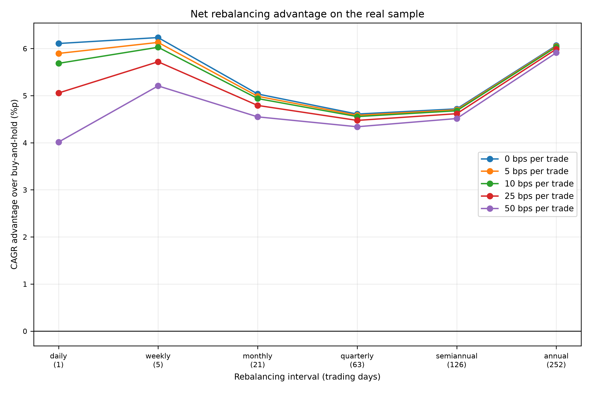
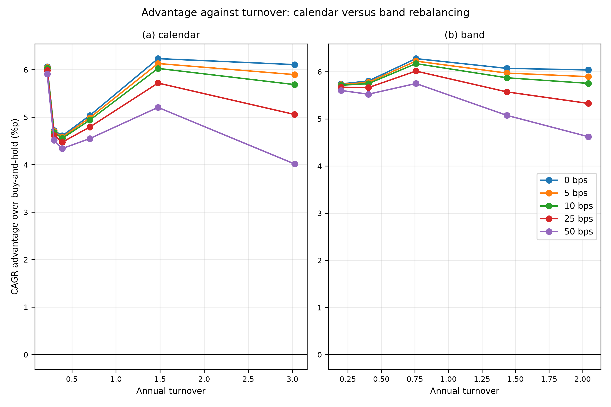
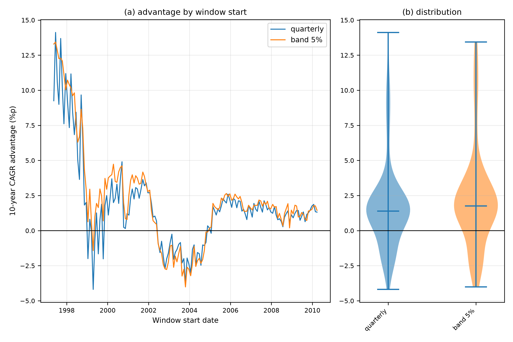

# Shannon's Demon

Rev. 6 | Created: 2026-08-29 | Updated: 2026-08-30 07:45 UTC

> **Goal** — 리밸런싱이 만드는 성장률 이득의 크기를 수치로 확정한다. "리밸런싱은 좋다" 가 아니라 "연 몇 %p 이며 거래비용 몇 bps 에서 사라지는가" 를 판단 기준으로 쓸 수 있게 한다.
>
> **Non-Goals** — 자산 3개 이상의 최적 배분, 세금·환율·leverage 모형, 종목 선택 규칙은 다루지 않는다. 실제 시세는 두 종목의 사후 표본 하나이며, 전략 추천이 아니라 모형 검증에 쓴다.
>
> **Background** — Claude Shannon 이 1966년 MIT 강연에서 제시한 예시가 출발점이다 \[[4](#ref-4)\]. 이 주장은 널리 인용되지만 인용되는 수치는 대개 극단적 parameter 에서 나온 것이고, 거래비용을 뺀 값이 아니다. 이 문서는 원래 주장을 재현한 뒤, 현실적 volatility 와 거래비용에서 무엇이 남는지를 확인한다.

## 1. The claim

기대 성장률이 0 인 자산과 현금을 반씩 들고 매 기간 비중을 원래대로 되돌리면 포트폴리오가 복리로 자란다. 이것이 Shannon 의 주장이다.

없던 수익이 생긴다는 뜻으로 읽히기 쉬워 Shannon's Demon 이라는 이름이 붙었지만 공짜는 아니다. 이득의 출처는 변동성이며 크기는 변동성의 제곱에 비례한다. 이 문서는 그 크기를 네 단계로 좁혀 간다. 이상화된 동전 던지기에서 재현하고, 닫힌 형태로 크기를 구하고, 거래비용을 빼고, 마지막으로 실제 시세에 대어 본다.

## 2. The coin-flip game

### 2.1 Setup

자산은 둘이다. 주식은 매 기간 확률 $p$ 로 $u$ 배, 확률 $1-p$ 로 $d$ 배가 되고 현금은 $c$ 배가 된다. 이 장의 수치는 $u = 2$, $d = 0.5$, $c = 1$, $p = 0.5$ 에서 얻었다. 주식만 들고 있으면 산술평균 수익률은 +25% 이지만 기하평균이 $\sqrt{u d} = 1$ 이므로 장기 성장률이 정확히 0 이다. 이 격차가 variance drag 이며, 리밸런싱이 줄이는 대상도 이것이다.

주식 비중을 $f$ 로 고정하고 매 기간 되돌리면 한 기간의 포트폴리오 배수는 $f u + (1-f) c$ 또는 $f d + (1-f) c$ 가 된다. 리밸런싱을 하지 않으면 각 sleeve 가 따로 복리로 자라고 비중이 표류한다. 두 전략에 같은 동전 던지기 배열을 쓰므로 두 결과의 차이는 난수가 아니라 운용 규칙에서만 온다.

### 2.2 Rebalanced versus buy-and-hold

Table 1. Terminal wealth after 100 periods over 20,000 paths
| Strategy | Median terminal wealth | Mean terminal wealth | Median return per period | 5th percentile | 95th percentile | Loss probability |
|---|---|---|---|---|---|---|
| rebalanced | 361.0989 | 8.130e+04 | +6.0660% | 1.411 | 9.244e+04 | 0.04555 |
| buy_and_hold | 1.0000 | 7.217e+06 | +0.0000% | 0.500 | 3.277e+04 | 0.46685 |

buy-and-hold 의 기간당 중앙 수익률은 +0.0000% 로 주식 단독의 성장률과 일치한다. 리밸런싱 포트폴리오의 중앙 최종자산은 361.0989 로 기간당 +6.0660% 이다. 성장률이 0 인 자산 둘로 6% 가 나온다는 주장은 재현된다.


Fig 1. Sampled wealth paths of both strategies on a log scale


Fig 2. Distribution of log growth per period over 20,000 paths

Table 1 의 평균 열은 반대 방향을 가리킨다. buy-and-hold 의 평균이 리밸런싱 포트폴리오의 평균보다 두 자릿수 크지만, 이는 극히 드문 우측 꼬리 때문이며 경로의 0.46685 가 원금을 잃는다. 산술평균으로 전략을 고르면 정반대의 결론에 이른다.

### 2.3 The weight that maximises growth

50:50 은 임의의 선택이 아니라 이 게임의 기대 log 성장률을 최대화하는 비중이다. 기대 log 자산을 최대화하는 이 규칙이 Kelly criterion 이다 \[[1](#ref-1)\]\[[3](#ref-3)\]. 닫힌 해와 수치 최적화가 모두 0.500000 을 주며 둘의 차이는 3.33e-16 이다.

곡선은 최적점 근처에서 평평하다. 비중을 40% 나 60% 로 두어도 기간당 수익은 5.8301% 로 최적값 6.0660% 에서 0.2359 %p 만 낮다. 승률을 정확히 모르는 실제 상황에서 이 평평함이 여유가 된다.

## 3. The rebalancing bonus

### 3.1 Closed form

연속 리밸런싱 극한에서 고정 비중 포트폴리오의 log 성장률은 개별 자산 log 성장률의 가중평균보다 다음만큼 크다.

$$\text{bonus} = \frac{1}{2}\left(\sum_i w_i \sigma_i^2 - \sigma_p^2\right), \qquad \sigma_p^2 = w^{\top} \Sigma w$$

이 항은 stochastic portfolio theory 에서 excess growth rate 로 불리는 양과 같다 \[[2](#ref-2)\]. 두 자산의 volatility 가 같고 비중이 $w$, $1-w$ 일 때 $w (1-w) \sigma^2 (1 - \rho)$ 로 정리된다. volatility 의 제곱에 비례하고 correlation 이 낮을수록 커진다.

### 3.2 Magnitude at realistic parameters

Table 2. Closed-form gross bonus in %p of annual log growth
| Annual volatility | rho = -0.90 | rho = 0.00 | rho = +0.90 |
|---|---|---|---|
| 10% | 0.47 | 0.25 | 0.03 |
| 20% | 1.90 | 1.00 | 0.10 |
| 60% | 17.10 | 9.00 | 0.90 |


Fig 3. Gross rebalancing bonus over volatility and correlation

2장의 6% 를 만든 것은 리밸런싱이 아니라 자산의 변동성 크기이다. 배수가 2배와 반토막이라는 설정은 실제 시장에 없다. Table 2 가 보이듯 보너스는 volatility 의 제곱에 비례하므로, volatility 를 20% 로 낮추면 같은 원리에서 나오는 값은 1.00 %p 수준으로 떨어진다.

### 3.3 What the closed form actually compares

기본 parameter ( volatility 20%, correlation +0.20 ) 에서 closed form 값은 0.8000 %p 이다. 일간 리밸런싱 simulation 이 개별 자산 성장률의 가중평균 대비 얻은 값은 0.8006 %p 로 차이는 0.0006 %p 이다.

그러나 이 식의 비교 대상은 buy-and-hold 가 아니라 **개별 자산 성장률의 가중평균** 이다. buy-and-hold 는 이긴 자산의 비중이 저절로 올라가므로 같은 격차의 일부를 스스로 벌어들인다. 같은 실행에서 buy-and-hold 가 비중 표류만으로 얻은 값은 0.3459 %p 이며, 그래서 실제로 buy-and-hold 를 상대로 얻는 이득은 4장의 0.46 %p 수준이다.

교과서 공식을 그대로 인용하면 실제 이득을 약 1.7배 부풀리게 된다. 두 자산의 parameter 가 같은 이 설정에서 buy-and-hold 의 장기 성장률은 가중평균이 아니라 더 잘한 자산 쪽으로 수렴하기 때문이다.

## 4. Cost decides the frequency

### 4.1 Net bonus after transaction cost

거래비용은 거래된 금액에 비례하는 one-way 비용으로 두고 매수와 매도 양쪽에 각각 부과한다. buy-and-hold 는 거래가 없으므로 비용도 0 이다.

Table 3. Median CAGR advantage over buy-and-hold in %p
| Rebalancing interval | 0 bps | 5 bps | 10 bps | 25 bps | 50 bps |
|---|---|---|---|---|---|
| daily (1) | +0.4752 | +0.3914 | +0.3049 | +0.0544 | -0.3704 |
| weekly (5) | +0.4746 | +0.4365 | +0.3981 | +0.2843 | +0.0961 |
| monthly (21) | +0.4645 | +0.4455 | +0.4267 | +0.3714 | +0.2806 |
| quarterly (63) | +0.4610 | +0.4503 | +0.4397 | +0.4089 | +0.3568 |
| semiannual (126) | +0.4156 | +0.4091 | +0.4025 | +0.3808 | +0.3422 |
| annual (252) | +0.3621 | +0.3566 | +0.3512 | +0.3351 | +0.3072 |

Table 4. Turnover, break-even cost and win rate by rebalancing interval
| Rebalancing interval | Median annual turnover | Break-even cost | Win rate at 0 bps |
|---|---|---|---|
| daily (1) | 1.6033 | 28.1 bps | 0.6900 |
| weekly (5) | 0.7169 | 62.7 bps | 0.6900 |
| monthly (21) | 0.3488 | 126.5 bps | 0.6900 |
| quarterly (63) | 0.2004 | 221.7 bps | 0.6810 |
| semiannual (126) | 0.1419 | 282.1 bps | 0.6860 |
| annual (252) | 0.0995 | 330.3 bps | 0.6770 |


Fig 4. Net rebalancing bonus after transaction cost

두 표를 함께 보면 실행 규칙이 나온다. 무비용 이득은 간격에 거의 무관한데 ( 일간 +0.4752 %p 에서 연간 +0.3621 %p ) 회전율은 간격에 크게 반응하므로, 최적 간격은 이론이 아니라 비용이 정한다. 개인 투자자에게 흔한 25 bps 수준에서는 분기 리밸런싱이 가장 낫고, 50 bps 에서 일간 리밸런싱은 -0.3704 %p 로 부호가 바뀐다. 손익분기 비용이 일간 28.1 bps 와 연간 330.3 bps 사이에서 열 배 이상 벌어진다는 것이 이 표의 요지이다.

비용이 0 이어도 이득이 양수인 경로의 비율은 어느 간격에서나 0.68 에서 0.69 사이이다. 리밸런싱은 확실한 이득이 아니라 확률적으로 유리한 규칙이다.

이 계산에는 세금이 없다. 과세 계좌에서 리밸런싱은 실현 손익을 만들므로 실효 비용은 위의 bps 보다 크고, 따라서 손익분기 값은 상한으로 읽어야 한다.

### 4.2 Autocorrelation

수익률이 독립이라는 가정을 풀기 위해 log 수익률에 AR(1) 을 준다. 계수 $\phi$ 가 양이면 추세가, 음이면 평균회귀가 생긴다.

여기에는 답이 갈리는 선택이 하나 있다. $\phi$ 를 바꿀 때 volatility 가 무엇을 고정하는가이다. 한 기간의 volatility 를 고정하면 추세가 장기 volatility 를 함께 키우므로 $\phi$ 를 올릴수록 수확할 변동성이 늘어난다. 누적 log 수익률의 1년 volatility 를 고정하면 $\phi$ 는 같은 양의 위험을 기간 사이에 재배치할 뿐이다. 두 선택은 부호가 반대인 답을 주므로 조용히 고르지 않고 CLI option 으로 노출했으며, 아래 수치는 후자를 쓴다.

Table 5. Median CAGR advantage in %p by AR(1) coefficient, one-year volatility held fixed
| AR(1) coefficient | Median advantage | 25th percentile | 75th percentile |
|---|---|---|---|
| -0.30 | +0.4958 | -0.1672 | +0.7616 |
| -0.20 | +0.4853 | -0.1758 | +0.7517 |
| -0.10 | +0.4741 | -0.1876 | +0.7445 |
| -0.05 | +0.4692 | -0.1930 | +0.7403 |
| 0.00 | +0.4645 | -0.1982 | +0.7353 |
| +0.05 | +0.4599 | -0.2035 | +0.7304 |
| +0.10 | +0.4539 | -0.2079 | +0.7264 |
| +0.20 | +0.4489 | -0.2145 | +0.7158 |
| +0.30 | +0.4422 | -0.2202 | +0.7044 |


Fig 5. Rebalancing advantage against return autocorrelation

방향은 통념과 맞는다. 평균회귀에서 이득이 커지고 추세에서 작아진다. 그러나 $\phi$ 를 -0.30 에서 +0.30 까지 움직여도 중앙값은 0.0536 %p 만 변하며, 같은 표의 사분위 폭 0.9 %p 에 비하면 무시할 만하다.

이 결과는 각 자산이 자기 수익률에 대해 갖는 autocorrelation 만 다룬다. 리밸런싱을 실제로 해치는 것으로 알려진 것은 두 자산 사이의 상대 모멘텀, 즉 한쪽이 계속 이기는 상황이며 이 모형은 그것을 담지 않는다. 두 자산에 같은 $\phi$ 를 주면 상대 수익률도 같은 $\phi$ 를 물려받아 효과가 상쇄되기 때문이다.

## 5. Real prices

AAPL 과 AMZN 의 공통 기간 1997-05-15 부터 2020-04-01 까지 5,758 거래일에 같은 질문을 다시 던졌다. 두 종목 모두 조정 종가를 쓰고 목표 비중은 50:50 이다.

### 5.1 The model holds

표본 기간의 실현 volatility 는 AAPL 45.01%, AMZN 58.49% 이고 correlation 은 0.3006 이다. 이 값을 3.1 절의 식에 넣으면 closed form 보너스는 4.8309 %p 이고, 같은 기간 일간 리밸런싱이 개별 자산 성장률의 가중평균 대비 실제로 얻은 값은 4.8219 %p 이다. 차이는 0.0090 %p 이다.

정규분포와 독립을 가정한 식이 팻테일과 volatility clustering 이 가득한 23년치 실제 시세에서 이 정도로 맞는다. 보너스의 크기를 정하는 것은 수익률 분포의 세부 모양이 아니라 volatility 와 correlation 두 값이라는 뜻이다.

가중평균 자산 CAGR 은 +32.8062%, buy-and-hold 는 +33.2599% 로, 3.3 절이 말한 비중 표류의 몫은 여기서 0.3411 %p 이다.

### 5.2 Policy ranking

Table 6. CAGR advantage over buy-and-hold in %p by policy and cost
| Policy | 0 bps | 5 bps | 10 bps | 25 bps | 50 bps | Annual turnover |
|---|---|---|---|---|---|---|
| daily | +6.1070 | +5.8963 | +5.6859 | +5.0567 | +4.0141 | 3.0260 |
| weekly | +6.2330 | +6.1300 | +6.0272 | +5.7189 | +5.2066 | 1.4768 |
| monthly | +5.0349 | +4.9863 | +4.9377 | +4.7921 | +4.5496 | 0.7029 |
| quarterly | +4.6089 | +4.5820 | +4.5550 | +4.4741 | +4.3393 | 0.3914 |
| semiannual | +4.7196 | +4.6990 | +4.6784 | +4.6166 | +4.5137 | 0.2985 |
| annual | +6.0647 | +6.0493 | +6.0340 | +5.9879 | +5.9112 | 0.2203 |
| band 1% | +6.0375 | +5.8953 | +5.7532 | +5.3277 | +4.6213 | 2.0435 |
| band 2% | +6.0713 | +5.9713 | +5.8714 | +5.5722 | +5.0748 | 1.4352 |
| band 5% | +6.2776 | +6.2248 | +6.1719 | +6.0135 | +5.7498 | 0.7577 |
| band 10% | +5.8037 | +5.7757 | +5.7476 | +5.6635 | +5.5233 | 0.4035 |
| band 20% | +5.7407 | +5.7269 | +5.7131 | +5.6715 | +5.6023 | 0.1991 |


Fig 6. Wealth curves of the sampled policies on a log scale


Fig 7. Net advantage of each calendar interval against transaction cost


Fig 8. Advantage against turnover, calendar versus band rebalancing

모든 정책이 모든 비용 수준에서 양수이며 최소값은 일간 리밸런싱의 50 bps 에서 +4.0141 %p 이다. 이 값들이 3.2 절의 1.00 %p 보다 훨씬 큰 이유는 두 종목의 volatility 가 45% 와 58% 로 가정치의 두 배 이상이기 때문이며, 리밸런싱이 더 잘 듣는다는 뜻이 아니다.

4.1 절의 규칙은 부분적으로만 재현된다. 비용이 오를수록 회전율이 낮은 정책이 유리해지는 방향은 같지만, 여기서 가장 높은 것은 분기가 아니라 밴드 5% 이고 연간 리밸런싱도 상위권이다. 이 표본의 두 종목이 몇 년 단위의 큰 등락을 겪었기 때문이며, 최적 정책은 표본에 따라 달라지고 일반화되지 않는다.

밴드 방식은 기대대로 작동한다. 밴드 5% 는 회전율 0.7577 로 월간 리밸런싱의 0.7029 와 비슷하면서 모든 비용 수준에서 더 높다. 거래 시점을 달력이 아니라 실제 이탈 정도가 정하기 때문이다.

### 5.3 Dependence on the starting date

Table 7. Advantage in %p over 155 rolling 10-year windows at 5 bps
| Policy | Median | 25th percentile | 75th percentile | Worst | Best | Win rate |
|---|---|---|---|---|---|---|
| band 5% | +1.7539 | +0.6641 | +3.0945 | -4.0140 | +13.4372 | 0.8000 |
| quarterly | +1.3864 | +0.2569 | +2.2629 | -4.1883 | +14.1212 | 0.7677 |


Fig 9. Rebalancing advantage over rolling 10-year windows

두 정책 모두 사분위 구간의 아래쪽 끝이 양수여서 구간을 언제 시작하든 중앙값 근처가 유지된다. 그러나 최악과 최선의 폭이 18 %p 를 넘고 구간의 다섯 중 하나 이상에서 이득이 음수이다. 이 표본은 종목 2개이며 둘 다 사후에 크게 오른 종목이므로, 5장의 수치는 기대값이 아니라 이 두 종목의 이 기간에 대한 사실로만 읽어야 한다.

## 6. Limits and next steps

- 자산 2개, parameter 동일, correlation 상수라는 설정. 실제 포트폴리오의 자산은 volatility 와 기대수익이 서로 다르고 correlation 은 시기에 따라 변한다.
- 정규분포 가정. 팻테일과 volatility clustering 이 없으므로 위기 구간에서 리밸런싱이 겪는 실제 손실이 과소평가된다.
- 세금과 호가 스프레드 미반영. 4.1 절에서 적었듯 손익분기 비용은 상한이다.
- 실제 시세 표본이 종목 2개, 기간 1개. survivorship bias 가 있다.

다음 단계로는 상대 모멘텀을 직접 모형에 넣어 4.2 절의 미해결 부분을 확인하는 것, 그리고 backtest 를 여러 종목 조합으로 반복해 Table 6 의 정책 순위가 표본에 얼마나 의존하는지 보는 것이 가장 값이 크다.

## References

<a id="ref-1"></a>
[1] Kelly, J. L. Jr. "A New Interpretation of Information Rate." Bell System Technical Journal 35, no. 4 (1956): 917–926. DOI 10.1002/j.1538-7305.1956.tb03809.x

<a id="ref-2"></a>
[2] Fernholz, R., and B. Shay. "Stochastic Portfolio Theory and Stock Market Equilibrium." Journal of Finance 37, no. 2 (1982): 615–624. DOI 10.1111/j.1540-6261.1982.tb03584.x

<a id="ref-3"></a>
[3] Thorp, E. O. "The Kelly Criterion in Blackjack, Sports Betting, and the Stock Market." In Handbook of Asset and Liability Management, Volume 1, 385–428. North-Holland, 2006. DOI 10.1016/S1872-0978(06)01009-X

<a id="ref-4"></a>
[4] Poundstone, W. Fortune's Formula: The Untold Story of the Scientific Betting System That Beat the Casinos and Wall Street. Hill and Wang, 2005. ISBN 978-0-8090-4599-0

---

## Appendix A. Terminology

- **AR(1)** — 현재 값이 직전 값의 상수배에 새 잡음을 더한 값이 되는 1차 자기회귀 과정. 계수가 양이면 추세, 음이면 평균회귀를 만든다.
- **band rebalancing** — 목표 비중에서 정한 폭 이상 벗어났을 때만 거래하는 방식. 달력이 아니라 이탈 정도가 거래 시점을 정한다.
- **bps** — basis point. 0.01% 이다.
- **buy-and-hold** — 최초 비중으로 매수한 뒤 거래하지 않는 운용. 비중은 자산의 성과에 따라 표류한다.
- **CAGR** — compound annual growth rate. 기간 수익을 연 복리 수익률로 환산한 값.
- **Kelly criterion** — 기대 log 자산을 최대화하는 베팅 비중을 구하는 규칙.
- **rebalancing bonus** — 고정 비중 포트폴리오의 log 성장률이 개별 자산 log 성장률의 가중평균을 넘는 부분.
- **Shannon's Demon** — 기대 성장률이 0인 자산과 현금을 정기적으로 리밸런싱하면 포트폴리오가 성장한다는 예시에 붙은 이름.
- **sleeve** — 포트폴리오를 자산별로 나눈 한 칸. 리밸런싱은 sleeve 사이에서 금액을 옮기는 일이다.
- **survivorship bias** — 결과를 알고 고른 표본 때문에 성과가 실제보다 좋아 보이는 편향.
- **turnover** — 한 해 동안 거래된 금액을 포트폴리오 규모로 나눈 값.
- **variance drag** — 변동성 때문에 기하평균 수익률이 산술평균 수익률보다 낮아지는 현상.
- **%p** — percentage point. 두 비율의 차이를 나타내는 단위.

## Appendix B. Reproduction

본문의 수치는 세 script 의 각 한 번의 실행에서 나왔다. 이 부록은 그 실행을 재현하는 방법만 담는다.

#### Pipeline

```text
shannon_demon.py    coin-flip game       -> chapter 2
rebalance_bonus.py  lognormal market     -> chapters 3 and 4
backtest.py         real price history   -> chapter 5
```

- `shannon_demon.py` — 동전 던지기 자산과 현금을 두고 리밸런싱과 buy-and-hold 를 같은 난수 위에서 비교한다.
- `rebalance_bonus.py` — 같은 효과를 lognormal 자산에서 측정한다. closed form 값, 거래비용을 뺀 값, autocorrelation 이 있을 때의 값을 낸다.
- `backtest.py` — 가정한 수익률 과정 대신 실제 시세를 읽어 같은 질문을 다시 던진다.

2.3 절의 최적 비중은 `kelly.py` 가 낸 값이며, 그 script 와 산출물은 이 문서의 범위 밖이다.

#### Parameters

Table 8. Coin-flip game parameters used in chapter 2
| Parameter | Value | Meaning |
|---|---|---|
| `--up-factor` | 2.0 | 상승 시 주식 배수 |
| `--down-factor` | 0.5 | 하락 시 주식 배수 |
| `--cash-factor` | 1.0 | 현금 배수 |
| `--up-prob` | 0.5 | 상승 확률 |
| `--stock-weight` | 0.5 | 주식 목표 비중 |
| `--n-periods` | 100 | 경로당 기간 수 |
| `--n-paths` | 20,000 | Monte Carlo 경로 수 |
| `--seed` | 20260829 | 난수 seed |

Table 9. Lognormal market parameters used in chapters 3 and 4
| Parameter | Value | Meaning |
|---|---|---|
| `--annual-drift` | 0.05 | 자산별 연 log drift |
| `--annual-volatility` | 0.20 | 자산별 연 volatility |
| `--correlation` | 0.20 | 두 자산 간 correlation |
| `--stock-weight` | 0.50 | 첫 자산 목표 비중 |
| `--steps-per-year` | 252 | 연간 simulation 단계 수 |
| `--n-years` | 20 | 경로 길이 |
| `--n-paths` | 1,000 | Monte Carlo 경로 수 |
| `--rebalance-intervals` | 1 5 21 63 126 252 | 리밸런싱 간격, 단계 수 |
| `--cost-bps` | 0 5 10 25 50 | one-way 거래비용 수준 |
| `--phi-grid` | -0.30 ~ +0.30 | AR(1) 계수 9개 |
| `--autocorr-normalization` | horizon | volatility 고정 기준 |

Table 10. Price data used in chapter 5
| Item | Value |
|---|---|
| Source | Kaggle, Stock Market Dataset ( jacksoncrow/stock-market-dataset ) |
| Origin | Yahoo Finance, snapshot dated 2020-04-02 |
| Tickers | AAPL, AMZN |
| Price column | `Adj Close`, split 과 배당 반영 |
| Common period | 1997-05-15 to 2020-04-01 |
| Aligned rows | 5,758 |
| Rolling window | 10 years, 21-day stride, 5 bps cost |

앞 두 script 는 외부 자료를 읽지 않으며 난수는 seed 가 고정된 generator 에서 나온다. 같은 seed 와 같은 option 이면 결과가 재현된다.

#### Output files

```text
Shannons_Demon_fig/
├── shannon_demon/
│   ├── terminal_wealth.csv
│   ├── wealth_paths.csv
│   ├── wealth_paths.png
│   └── growth_distribution.png
├── rebalance_bonus/
│   ├── bonus_grid.csv
│   ├── frequency_net_bonus.csv
│   ├── autocorrelation_effect.csv
│   ├── bonus_heatmap.png
│   ├── frequency_net_bonus.png
│   └── autocorrelation_effect.png
└── backtest/
    ├── data_provenance.json
    ├── aligned_prices.csv
    ├── strategy_wealth.csv
    ├── policy_cost_sweep.csv
    ├── rolling_windows.csv
    ├── wealth_curves.png
    ├── policy_cost_sweep.png
    ├── band_comparison.png
    └── rolling_windows.png
```

- `terminal_wealth.csv` — 1 file, shape (40,000 × 4). 1 row = 1 path × 1 strategy.
- `wealth_paths.csv` — 1 file, shape (8,080 × 4). 1 row = 1 path × 1 period × 1 strategy.
- `bonus_grid.csv` — 1 file, shape (63 × 3). 1 row = 1 volatility × 1 correlation.
- `frequency_net_bonus.csv` — 1 file, shape (30,000 × 9). 1 row = 1 path × 1 rebalancing interval × 1 cost level.
- `autocorrelation_effect.csv` — 1 file, shape (9,000 × 5). 1 row = 1 path × 1 AR(1) coefficient.
- `data_provenance.json` — 1 file. 시세 자료의 출처, 읽은 file, 정렬된 기간.
- `aligned_prices.csv` — 1 file, shape (5,758 × 3). 1 row = 1 date.
- `strategy_wealth.csv` — 1 file, shape (23,028 × 3). 1 row = 1 date × 1 strategy.
- `policy_cost_sweep.csv` — 1 file, shape (55 × 12). 1 row = 1 policy × 1 cost level.
- `rolling_windows.csv` — 1 file, shape (310 × 8). 1 row = 1 window × 1 policy.
- `*.png` — 9 files.

분포를 그리는 figure 는 요약값이 아니라 표본을 저장한다. 본문의 모든 수치는 위 csv 에서 계산했으며 figure 에서 눈으로 읽은 값이 아니다.

#### Safeguards

- `rebalance_bonus.py` 는 closed form 보너스와 simulation 값의 차이가 허용치를 넘으면 경고를 낸다.
- buy-and-hold 에 0 이 아닌 비용률을 넘기면 에러를 낸다. 거래하지 않는 전략에 거래비용을 붙이는 것은 호출자의 모순이지 기본값으로 덮을 일이 아니다.
- `backtest.py` 의 출처 인자는 필수이며 결과 folder 의 `data_provenance.json` 에 그대로 기록된다. 수치가 출처와 분리되지 않게 하기 위함이다.
- 날짜 형식이 모호한 가격 file 은 `--date-format` 으로 지정한다. 지정하지 않으면 day-first 를 month-first 로 읽어도 아무 경고가 나지 않는다.

## Appendix C. CLI (Command Line Options)

세 script 모두 option 없이 실행하면 이름과 version 을 출력하고, `-h` 로 전체 목록을, `-v` 로 version 을 보인다. `--output-folder` 는 필수이며 모든 산출물의 root 가 된다. Script 는 이 문서의 상위 folder 아래 `src` 에 있으며, 아래 명령은 이 문서가 있는 folder 를 기준으로 한다.

```bash
python3 ../src/shannon_demon.py   --output-folder Shannons_Demon_fig
python3 ../src/rebalance_bonus.py --output-folder Shannons_Demon_fig
python3 ../src/backtest.py        --output-folder Shannons_Demon_fig \
    --price-folder <PRICE_FOLDER> --tickers AAPL AMZN --price-column "Adj Close" \
    --source-name "<DATASET_NAME>" --source-url "<DATASET_URL>" --source-origin "<ORIGIN>"
```

Table 11. CLI options of `shannon_demon.py`
| Option | Type | Default | Required | Description |
|---|---|---|---|---|
| `--output-folder` | path | — | yes | 산출물 root |
| `--up-factor` | float | 2.0 | no | 상승 시 주식 배수 |
| `--down-factor` | float | 0.5 | no | 하락 시 주식 배수 |
| `--cash-factor` | float | 1.0 | no | 현금 배수 |
| `--up-prob` | float | 0.5 | no | 상승 확률 |
| `--stock-weight` | float | 0.5 | no | 주식 목표 비중 |
| `--n-periods` | int | 100 | no | 경로당 기간 수 |
| `--n-paths` | int | 20000 | no | 경로 수 |
| `--chunk-size` | int | 4000 | no | 한 번에 계산할 경로 수 |
| `--n-sample-paths` | int | 40 | no | 경로 figure 에 그릴 경로 수 |
| `--seed` | int | 20260829 | no | 난수 seed |

Table 12. CLI options of `rebalance_bonus.py`
| Option | Type | Default | Required | Description |
|---|---|---|---|---|
| `--output-folder` | path | — | yes | 산출물 root |
| `--annual-drift` | float | 0.05 | no | 자산별 연 log drift |
| `--annual-volatility` | float | 0.20 | no | 자산별 연 volatility |
| `--correlation` | float | 0.20 | no | 두 자산 간 correlation |
| `--stock-weight` | float | 0.50 | no | 첫 자산 목표 비중 |
| `--steps-per-year` | int | 252 | no | 연간 단계 수 |
| `--n-years` | int | 20 | no | 경로 길이 |
| `--n-paths` | int | 1000 | no | 경로 수 |
| `--rebalance-intervals` | int list | 1 5 21 63 126 252 | no | 리밸런싱 간격 |
| `--cost-bps` | float list | 0 5 10 25 50 | no | one-way 거래비용 |
| `--phi-grid` | float list | -0.30 ~ +0.30 | no | AR(1) 계수 |
| `--autocorr-interval` | int | 21 | no | AR(1) sweep 의 리밸런싱 간격 |
| `--autocorr-cost-bps` | float | 0.0 | no | AR(1) sweep 의 거래비용 |
| `--autocorr-normalization` | choice | horizon | no | `step` 또는 `horizon` |
| `--sigma-grid` | float list | 0.05 ~ 0.60 | no | 보너스 격자의 volatility |
| `--rho-grid` | float list | -0.90 ~ +0.90 | no | 보너스 격자의 correlation |
| `--seed` | int | 20260829 | no | 난수 seed |

Table 13. CLI options of `backtest.py`
| Option | Type | Default | Required | Description |
|---|---|---|---|---|
| `--output-folder` | path | — | yes | 산출물 root |
| `--price-folder` | path | — | yes | 종목당 csv 가 든 folder |
| `--tickers` | str list | — | yes | 보유 종목, 최소 2개 |
| `--weights` | float list | equal | no | 목표 비중 |
| `--date-column` | str | Date | no | 날짜 열 이름 |
| `--price-column` | str | Close | no | 가격 열 이름, 조정 종가 권장 |
| `--date-format` | str | inferred | no | 날짜 형식, 모호하면 지정 |
| `--source-name` | str | — | yes | 자료 dataset 이름 |
| `--source-url` | str | — | yes | 자료 dataset 주소 |
| `--source-origin` | str | — | yes | 그 dataset 의 원 출처 |
| `--rebalance-intervals` | int list | 1 5 21 63 126 252 | no | 정기 간격 |
| `--band-widths` | float list | 0.01 ~ 0.20 | no | 밴드 폭 |
| `--cost-bps` | float list | 0 5 10 25 50 | no | one-way 거래비용 |
| `--rolling-years` | int | 10 | no | 롤링 구간 길이 |
| `--rolling-stride-days` | int | 21 | no | 롤링 구간 시작 간격 |
| `--rolling-cost-bps` | float | 5.0 | no | 롤링 구간의 거래비용 |
| `--trading-days-per-year` | int | 252 | no | 연환산에 쓰는 거래일 수 |
